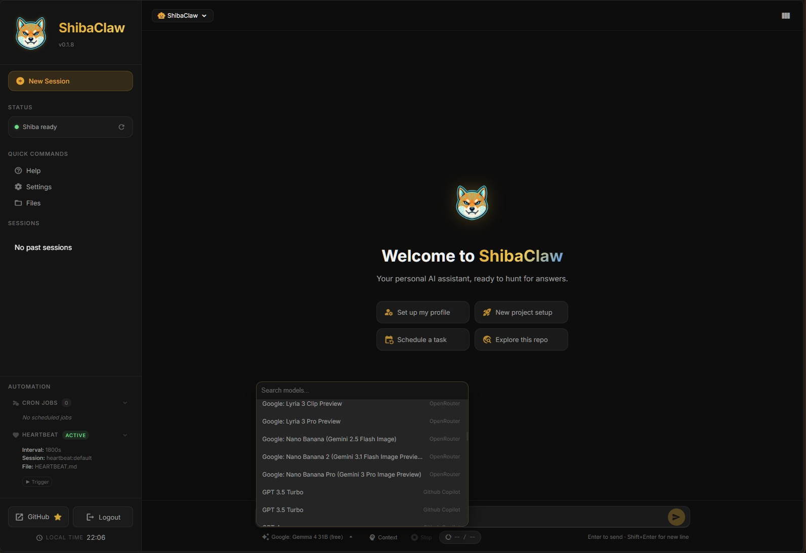

# Changelog

All notable changes to this project are documented in this file.

## [0.3.4] - 2026-05-08

### Fixed
- Fixed CI build failure caused by native Matrix E2E dependencies (`python-olm`). Matrix is now included without E2E encryption in the Windows bundle.

## [0.3.3] - 2026-05-08

### Fixed
- Fixed CI build size by ensuring all integration channel dependencies (extras) are installed before packaging.
- Resolved local versioning discrepancy in PyInstaller bundles by reinstalling the editable package metadata.

## [0.3.2] - 2026-05-08

### Fixed
- Bundled native Windows runtime DLLs (pywebview, pythonnet, clr_loader) in GitHub Actions builds.
- Improved CI smoke testing to verify desktop native dependencies during packaging.

## [0.3.1] - 2026-05-08

### Fixed
- **OAuth model not recognised at startup** — When `provider` is `"auto"` and the saved model has no provider prefix (e.g. `oswe-vscode-prime` instead of `github_copilot/oswe-vscode-prime`), the provider resolver now correctly falls back to an authenticated OAuth provider instead of routing the model to a generic gateway that rejects it. Eliminates the "is not a valid model" error on every cold start.

### Changed
- **Code cleanup & optimisations** — Consolidated duplicate `_normalize_save_memory_args` / `_normalize_update_memory_args` into a single `_normalize_tool_args` helper; fixed indentation bug in `sync_workspace_templates` that caused redundant overwrite prompts; modernised typing imports in `brain/routing.py`; removed dead code in `cli/gateway.py`.

## [0.3.0] - 2026-05-07

### Added
- **Release Automation** — Added documentation and helpers for managing GitHub releases.
- **Native Windows Desktop Launcher** — Added a seamless pywebview-based Windows desktop client (`ShibaClaw.exe`) featuring a system tray icon, window state management, and bundled assets.

### Changed
- **Desktop WebUI Authentication** — Disabled authentication by default for the native Desktop launcher to improve the out-of-the-box local experience.
- **Session titles cleanup in WebUI history** — Sidebar session titles are now normalized by removing channel prefixes (e.g. `webui_`, `telegram_`, `heartbeat:`, `cron:`), keeping names cleaner and easier to scan.
- **Channel tag under session title** — Each session row now shows its channel as a dedicated tag on the subline (under the title), separate from date/time metadata for improved visual hierarchy.
- **Channel-aware badge palette** — Session channel tags now use coherent per-channel colors in the sidebar (`Web UI` gold/yellow, `Telegram` blue, `Discord` dark blue, `Heartbeat` dark violet, plus dedicated styles for `Cron`, `Slack`, `API`, and `CLI`).
- **Sidebar session subline alignment polish** — Refined spacing, pill sizing, and vertical alignment for channel tags and timestamp metadata to improve readability and consistency across active/inactive rows.

### Fixed
- **Desktop Windows Startup Crash** — Fixed a `NoneType` exception in `loguru` on Windows packaged builds (`console=False`) where `sys.stderr` is `None`.
- **Desktop Subprocess Fork Bomb** — Intercepted `gateway` commands in the PyInstaller entry point to prevent infinite recursive UI window spawning during gateway startup.
- **Cron Jobs Execution** — Fixed a bug where Cron jobs were not correctly wired into the agent lifecycle (Gateway callbacks were missing). The gateway now correctly arms and stops the internal cron loop during startup/shutdown.
- **Cron Jobs UI Visibility** — Added `hidden` metadata to cron task prompts so that routine reminder requests and task payloads do not clutter the WebUI chat session interface.
- **Cron Jobs blocking Timers** — Decoupled Cron execution by running tasks via asynchronous background workers. LLM response times will no longer block the main cron timer loop, resolving timeouts and "frozen" UI situations while processing automated tasks.

## [0.2.1] - 2026-05-03

### Fixed
- **Dependencies aligned** — Updated and pinned several Python dependencies to resolve version conflicts and improve installation reliability across environments.
- **WebUI sidebar polish** — Cleaned up sidebar layout and styling for better visual consistency; fixed minor alignment and overflow issues in the settings and navigation panels.

### Changed
- **Dependency maintenance** — Bumped `openai`, `httpx`, `pydantic`, and related packages to their latest compatible minor versions to pick up bug fixes and stability improvements.

## [0.2.0] - 2026-05-02

### ⚡ Dynamic Model Selection

  

**Change models per session** — no more single global model, but a flexible choice for every conversation.

- **Multi-Provider Search**: Search through all models from all your configured providers (OpenRouter, GitHub Copilot, Anthropic, etc.) in a single dropdown.
- **Session-Aware Routing**: Each session remembers its chosen model. You can have a coding session with `Claude 3.5 Sonnet` and a research session with `Gemma 4` simultaneously.
- **Runtime Switching**: Switch models instantly without restarting the agent; the gateway automatically resolves the correct endpoint based on the selected model.
- **Dedicated Memory Model**: Configure a separate model and provider specifically for memory consolidation and proactive learning, ensuring high-quality state extraction without affecting your chat budget.
- **Default-First**: New sessions automatically start with the default model set in settings, ensuring immediate consistency.

### Added
- **Cross-provider model catalog** — The WebUI now aggregates models from all configured providers into a single searchable catalog. Chat and settings both consume normalized model entries with canonical IDs and provider labels, so switching models no longer depends on a single provider-scoped dropdown.
- **Per-session model selection** — Every session can now store and use its own model independently. The chat footer includes a searchable model picker, making it practical to keep different sessions on different providers or reasoning tiers at the same time.
- **OpenRouter OAuth in the WebUI** — Added a browser PKCE flow for OpenRouter directly in Settings. On successful login, the returned API key is saved into the provider configuration automatically.

### Changed
- **Dynamic Settings Hot-Reload** — Saving settings in the WebUI no longer restarts the gateway process. The agent, channels, and heartbeat service are updated in-place via a new `POST /reload` endpoint on the gateway. Provider, model, tool configurations, MCP servers (lazy reconnect), and individual channels all hot-swap without interrupting active WebSocket connections or ongoing tasks. A full restart is still triggered automatically only when `gateway.host`, `gateway.port`, or `gateway.ws_port` change.
- **Model-first routing** — Runtime provider resolution is now driven by the selected model instead of a static global provider assumption. Canonical model IDs such as `openrouter/...` or `anthropic/...` are normalized before dispatch so the gateway reaches the correct backend endpoint.
- **Settings UX refresh** — The Agent tab is now centered on model choice: default model for new sessions, memory / consolidation model picker, and reusable searchable model menus. The old provider selector was removed from the Agent tab, and OAuth was moved directly below Providers in the settings sidebar.
- **Provider visibility in model search** — Chat and settings model pickers now show provider labels alongside model names, making mixed catalogs usable even when multiple providers expose similarly named models.

### Fixed
- **Custom Provider support** — The custom provider now correctly strips the `custom/` prefix before making requests and implements `get_available_models()`, enabling full integration with localized REST endpoints.
- **URL sanitization for providers** — Automatic stripping of trailing whitespaces and tabs in `api_base` properties, preventing invalid ASCII byte exceptions during chat fetches and model discovery.
- **Reasoning-only response visibility** — Chat responses consisting solely of reasoning blocks (e.g. some LM Studio or DeepSeek scenarios) without standard content are now safely rendered as Process Group bubbles in the WebUI.
- **GitHub Copilot model discovery** — Copilot now refreshes its short-lived session token before listing available models, fixing malformed authorization failures during catalog fetches.
- **Session override provider mismatches** — Session-level model overrides now ignore a forced global provider when the chosen model clearly belongs to another backend, ensuring the gateway actually switches provider at runtime.
- **WebUI / gateway session desync** — Session caches now reload when the underlying JSONL file changes on disk, preventing stale in-memory metadata from overriding model changes saved by the WebUI.
- **Model dropdown transparency** — The chat model dropdown and search input now use solid theme-backed colors instead of undefined CSS variables, eliminating transparent or unreadable menus.

## [0.1.8] - 2026-05-01

### Changed
- **WebUI client hardening** — Centralized safe DOM helpers for attachment links, icons, file-browser rows, and breadcrumb rendering so user-controlled labels are inserted via DOM nodes instead of HTML string interpolation.

### Fixed
- **WebUI XSS surfaces** — Escaped raw HTML in Markdown rendering, stopped interpolating attachment and file names into `innerHTML`, and switched confirm-dialog messages to `textContent` to prevent browser-side script injection from chat content, file names, or UI error strings.
- **WebUI logout/reconnect lifecycle** — Logging out or hitting a `401` now clears timers, stops automatic WebSocket reconnection, clears the cached auth token, and re-enters the login screen cleanly without background reconnect loops or duplicated startup state.
- **WebUI repeated bootstrap handlers** — `initSocket`, `initListeners`, file handlers, automation sections, and onboarding setup are now idempotent, preventing duplicated event handlers after login/logout cycles or repeated app startup.
- **Memory search runtime validation** — `memory_search` now rejects `top_k < 1` with a clear `ValueError` instead of returning misleading empty results or truncated output through negative slicing.
- **Python 3.14 test compatibility** — Memory search integration tests now run with `pytest-asyncio` coroutines instead of relying on the removed implicit main-thread event loop behavior.

## [0.1.7] - 2026-04-25

### Added
- **Reasoning Effort Fallback** — Implemented an automatic fallback mechanism for the `reasoning_effort` parameter. If a model does not support this parameter, the system now automatically retries the request without it instead of returning a 400 error.
- **WebUI Real-time Updates** — Enabled real-time message pushing via WebSockets for background tasks. Responses to subagent tasks are now delivered instantly to active WebUI sessions without requiring a page refresh.

### Changed
- **Subagent UI Privacy** — Subagent task summaries and technical logs are now hidden by default in the WebUI chat history. Users only see the final natural language response from the main agent, keeping the conversation clean while preserving the technical data in the session metadata.
- **Native Browser Integration Cleanup** — Temporarily removed the Native Browser (CDP) tools and settings to streamline the configuration process while the feature undergoes further refinement.
- **Lazy Session Creation** — Improved WebUI session management by preventing the immediate creation of empty session files on disk when clicking "New Session". Session files are now lazily generated only upon the first message, with `profile_id` cached in memory until persistence.
- **Smart Session Titling** — Enhanced the automatic session titling logic to prepend the source channel name (e.g., `Telegram_` or `webui_`) to the generated title based on the first message, providing better organization in the history list.

### Fixed
- **WebUI Context Reporting** — Fixed an issue where the WebUI token usage count didn't update after `autocompact` and could exceed 100%. The system now correctly calculates token usage based only on active (unconsolidated) messages and invalidates the context cache immediately when compaction occurs.
- **Gateway Attribute Error** — Resolved an `AttributeError: 'ToolsConfig' object has no attribute 'browser'` that caused gateway crashes after the browser configuration was removed. Fixed the initialization sequence in both `gateway.py` and `agent.py`.
- **WebUI Onboard 500 Error** — Fixed a `SyntaxError: Unexpected token 'I', "Internal S"...` error at the end of the onboarding wizard. This was caused by an `AttributeError` from a call to the deprecated `ensure_agent()` method in the onboard router.
- **Settings Router Cleanup** — Removed stale references and updated comments regarding the deprecated `ensure_agent()` method in the settings router.

## [0.1.6] - 2026-04-25

### Added
- **API Modularization & Routers** — Refactored the WebUI backend into dedicated API routers (`onboard`, `settings`, `sessions`, `gateway`, etc.), improving code organization and enabling easier extension of WebUI capabilities.
- **WebUI Communication Utilities** — Implemented specialized utilities for managing system prompts and session-aware gateway communication.

### Changed
- **Native WebSocket Transport** — Fully transitioned from Socket.IO to a custom, native WebSocket implementation. This change reduces dependency overhead and provides a more direct, robust communication channel between the WebUI and the agent gateway.

## [0.1.5] - 2026-04-24

### Fixed
- **Telegram (and other optional channels) not starting in Docker** — The `Dockerfile` installed only the base package (`uv pip install .`), silently skipping the `[telegram]` optional extra. The bot appeared configured but never loaded — no polling, no messages. Fixed by installing `.[telegram]` so `python-telegram-bot` is always present in the image. Channels relying on other optional extras (e.g. `[slack]`) should be added to the Dockerfile extra list similarly.

## [0.1.4] - 2026-04-24

### Fixed
- **`AttributeError: 'list' object has no attribute 'strip'`** — Memory consolidation crashed during `maybe_proactive_learn()` when messages contained multi-part content (OpenAI-style `[{"type": "text", "text": "..."}]` format). Added `_normalize_content()` to `ScentKeeper._format_messages()` to handle `str`, `list`, and `None` content uniformly. *(Thanks [@itskun](https://github.com/itskun) for the report! — [#18](https://github.com/RikyZ90/ShibaClaw/issues/18))*
- **Channel Status missing configured channels** — `shibaclaw channels status` silently omitted any channel whose optional dependency was not installed (e.g. Telegram without `python-telegram-bot`). Channels with unresolvable imports now appear in the table with a `! missing dep` indicator, making misconfigured setups immediately visible.

### Added
- **`SHIBACLAW_DEBUG` env var** — Set `SHIBACLAW_DEBUG=true` (or `1`/`yes`/`on`) to force `DEBUG` log level with full backtraces and source-file annotations, without needing the `--verbose` flag. Useful for Docker deployments. The variable is documented in `docker-compose.yml` as a commented-out example.

## [0.1.3] - 2026-04-19

### Added
- **Native OpenAI SDK Support**: Added `OpenAIThinker` to replace the generic compatibility wrapper, providing direct integration with the OpenAI Python SDK and supporting provider-specific tool call metadata preservation.
- **Advanced Configuration Loader**: Implemented a robust configuration system with automatic state migration and streamlined plugin onboarding.

### Fixed
- **MCP WebUI Visibility**: Resolved an issue affecting the display of MCP servers in the WebUI.
- **Gemini Streaming Tool Signatures**: Fixed an issue where Gemini streaming was dropping or malforming tool signatures. *(Thanks @shirik for the PR!)*

## [0.1.2] - 2026-04-19

### Fixed
- **CI/CD — 88 lint errors eliminated**: All `ruff` violations across the codebase have been resolved (naming conventions, unused imports, ambiguous variable names, import ordering, E402 module-level imports). CI workflows now pass cleanly on every release.
- **WebSocket connection drops during long tasks (`connection_lost`)**: Disabled automatic WebSocket ping/pong timeouts at all three transport layers (Uvicorn, gateway WS server, gateway WS client). The periodic "ping" mechanism was erroneously closing live connections when the agent was busy and could not respond in time.
- **Thinking panel flash / timer freeze**: Removed a spurious `hideThinking()` call from the `agent_response_chunk` event handler. Previously, each streamed response token was hiding the thinking panel, causing a visible flash when the model transitioned between generation and tool use, and making the elapsed-time counter appear frozen.
- **File browser and settings blocked while agent is running**: The gateway WebSocket handler was awaiting `agent.process_direct()` inline, which blocked the entire WS event loop for that client. Any concurrent request (e.g. health checks, settings) would time out until the agent finished. The chat handler is now launched as a separate `asyncio.Task`, keeping the handler loop free.
- **Gateway health check noise while processing**: `checkGatewayHealth()` in the frontend now skips entirely when `state.processing` is true, preventing unnecessary timeout errors and false "Gateway Down" status while the agent is working.

### Changed
- **`_CHAT_TIMEOUT` increased** from 120 s to 1800 s in `shibaclaw/thinkers/base.py` to accommodate complex multi-step reasoning tasks.

## [0.1.1] - 2026-04-19

### Fixed
- **Hotfix**: Fixed an `ImportError` on CLI startup (`setup_shiba_logging` missing from `shibaclaw/cli/utils.py`) caused by aggressive autolinting.

## [0.1.0] - 2026-04-19

### Added
- **Official API Documentation**: Full REST API reference is now available in `docs/API_REFERENCE.md`.
- **CI Pipeline**: Automated testing and linting (pytest + ruff) via GitHub Actions.
- **API Test Suite**: Proper integration tests for WebUI routers via Starlette TestClient.

### Changed
- **Beta Milestone**: Promoted project status from Alpha to Beta (`Development Status :: 4 - Beta`).
- **Refined Footprint**: Channel-specific SDKs (Telegram, Slack, DingTalk, Feishu, QQ, WeCom, Matrix) have been moved to optional extras for a leaner default install.
- **Dependencies**: Added upper bound on the `openai` dependency to prevent unexpected breaking changes from v3.0.0+.

## [0.0.40] - 2026-04-19

### Added
- **Memory compaction WebUI notification** — After auto-compaction, the backend now broadcasts a `memory_compacted` event to all connected WebUI clients. When the context viewer is open, it auto-refreshes to reflect the compacted token count.
- **WebSocket broadcast support** — `deliver_to_browsers()` now accepts an empty `session_key` to broadcast a message to all connected clients, with a configurable `msg_type` parameter for custom event types.
- **Session status emission on processing** — The WebSocket handler now emits `session_status` updates immediately when a message starts processing, keeping the UI in sync with the backend state.

### Fixed
- **WebUI stuck on "Connecting..."** — A JavaScript syntax error in `ui_panels.js` (mismatched bracket `});` instead of `}` in the memory compaction listener) prevented the entire file from executing. Since `ui_panels.js` defines `startApp()`, this blocked WebSocket initialization and left the UI permanently stuck on "Connecting..." with no token prompt and no errors in the console.

## [0.0.38] - 2026-04-18

### Added
- **Token-by-token response streaming** — The LLM response is now streamed to the browser in real time, character by character. Supported natively for all OpenAI-compatible providers (OpenRouter, GitHub Copilot, Groq, DeepSeek, etc.) and Anthropic via their respective streaming APIs. Providers without native streaming support (Azure, Custom, Codex) automatically fall back to delivering the full response in one shot without errors.
  - New abstract method `chat_streaming()` on `Thinker` base class, with a non-streaming default fallback so existing provider subclasses work unchanged.
  - New `chat_with_retry_streaming()` on `Thinker` base class with the same transient-error retry logic (backoff on 429/5xx) as `chat_with_retry()`.
  - `OpenAIThinker` and `AnthropicThinker` implement true streaming via `stream=True` / `messages.stream()`.
  - `GithubCopilotThinker` overrides `chat_streaming()` to refresh the short-lived OAuth session token before each streaming call (same pattern as its `chat()` override).
  - `on_response_token` callback threaded through `_run_agent_loop` → `_process_message` → `process_direct`.
  - Gateway emits `chat.response_token` WebSocket events for each text delta.
  - `GatewayClient.chat_stream()` yields `{"t": "rt"}` events for response token chunks.
  - `ws_handler` accumulates streamed content and forwards `response_chunk` messages to the browser.
  - Browser (`realtime.js`, `api_socket.js`) progressively renders each chunk into a live message bubble using the existing Markdown renderer; the bubble is finalised with the complete content when the `response` event arrives.

### Fixed
- **Streaming bubble stuck on tool call** — If the model emits text tokens then switches to a tool call (e.g. extended thinking before tool use), the partial streaming bubble is now immediately removed when a `thinking` or `tool` progress event arrives, preventing stale content from showing in the chat.
- **Processing state locked after empty response** — When the agent dispatches a reply through a channel tool (e.g. `MessageTool`) and returns no direct WebUI response, the WebSocket handler previously did an early return without emitting a `response` event, leaving `state.processing = true` and the send button permanently disabled until page reload. The `response` event is now always emitted.

## [0.0.38] - 2026-04-18

### Added
- **Native WebSocket transport** — Replaced Socket.IO with a native WebSocket layer. The gateway now runs a dedicated WS server on port `19998`; the WebUI connects via a new `realtime.js` adapter (drop-in replacement for the Socket.IO client). Eliminates the `python-socketio` dependency from the core install — moved to the optional `[mochat]` extra. New files: `gateway_client.py`, `ws_handler.py`, `realtime.js`.
- **Gemini raw env-var support** — `GEMINI_API_KEY` set in the environment is now accepted directly by the config and provider-matching logic without needing a stored key. Auto-detection via env var works alongside existing stored keys. *(Thanks [@shirik](https://github.com/shirik)!)*
- **Gemini OpenAI-compat endpoint** — `default_api_base` for the Gemini provider is now set to `https://generativelanguage.googleapis.com/v1beta/openai/`, enabling out-of-the-box routing without manual configuration. *(Thanks [@shirik](https://github.com/shirik)!)*

### Changed
- **WebUI provider API-key placeholders** — Settings panel and Onboard wizard now show provider-specific placeholder text (`AIza…` for Gemini, `sk-ant-…` for Anthropic, `gsk_…` for Groq, etc.) instead of the generic `sk-...`. *(Thanks [@shirik](https://github.com/shirik)!)*
- **`message` tool workspace context** — `MessageTool` now receives and uses the agent workspace path to resolve relative media file paths, improving file-attachment reliability across channels.

## [0.0.37] - 2026-04-17

### Fixed
- **Dependency Vulnerabilities (CVE)** — Critical security update resolving RCE in `protobufjs` via `overrides` in the WhatsApp bridge and updating `cryptography`, `pytest`, and `python-multipart` to safe versions.

## [0.0.36] - 2026-04-16

### Fixed
- **`web --with-gateway` host routing** — Bare-metal launches now force the spawned gateway onto local loopback and export the correct internal WebUI URL, fixing `Gateway unreachable: [Errno -2] Name or service not known` when the saved config still pointed to the Docker hostname `shibaclaw-gateway` or when the WebUI used a custom port.
- **File Explorer modal UX** — The Files popup now scrolls correctly on tall directories and no longer closes when clicking outside the dialog.
- **Cron store reload noise** — Reload bookkeeping now refreshes the saved mtime after a successful `jobs.json` load, preventing repeated external-reload logs for the same file and downgrading the message to debug.

### Changed
- **Release metadata & docs** — README, deploy guide, Docker memory guidance, and update metadata now reflect the thin WebUI architecture and the recommended `shibaclaw web --with-gateway` flow.

## [0.0.35] - 2026-04-16

### Added
- **Distributed Architecture (WebUI Proxying)** — Integrated a thin-client architecture for the WebUI. The `shibaclaw-web` process no longer instantiates the LLM, memory, or background consumers. It delegates all processing via a new internal streaming API on the `shibaclaw-gateway`.
- **NDJSON Streaming API** — The gateway now supports streaming agent progress and tool execution status via HTTP, allowing remote UI clients to maintain real-time interactivity.
- **Heartbeat & Cron Delegation** — Automated tasks are now unified and run strictly in the gateway process, even when triggered from the WebUI.

### Fixed
- **Massive RAM usage reduction** — Eliminated duplication of the entire agent core between processes. `shibaclaw-web` memory footprint dropped by nearly 90% (no longer loads heavy ML models or provider libraries internally).
- **Service dependencies** — Added `depends_on` in `docker-compose` to ensure the gateway is available before the UI attempts to proxy requests.

## [0.0.31] - 2026-04-14

### Fixed
- **`exec` tool broken (NameError)** — Added the missing `_BoundedBuffer` class definition in `shell.py`. In v0.0.30 the class was referenced but never defined, causing every shell command to fail with `NameError: name '_BoundedBuffer' is not defined`.

## [0.0.30] - 2026-04-14

### Fixed
- **Race condition dual consumer** — Fixed a bug where WebUI in standalone mode started both inbound polling and outbound dispatcher, causing lost messages because it competed with its own outbound consumer.
- **Missing feedback on long execution** — `ExecTool` now sends a progress heartbeat every 15s to the UI during long-running commands, so it doesn't look stuck.
- **Subagent context explosion** — Subagent tool results are now properly truncated at 8,000 chars to avoid exploding the context window.
- **Hanging agent loop** — Added 120s timeout to LLM provider calls, 660s timeout to tool execution, and 600s overall wall-clock loop cap to prevent infinite hangs.
- **Telegram Conflict error loop** — Replaced silent retry loop with graceful fallback to outbound-only mode if another bot instance is polling.
- **Gateway connection check** — Added retry backoff when checking if gateway is reachable to give Docker container startup time to bind ports, preventing false negative conflicts.

## [0.0.28] - 2026-04-14

### Added
- **Heartbeat frontmatter config** — `HEARTBEAT.md` now supports a real YAML config block at the top for `session_key`, `profile_id`, and explicit `targets`.
- **Heartbeat target aliases** — output targets like `webui: recent` or `telegram: recent` now resolve to the most recent session for that channel.

### Changed
- **Heartbeat template semantics** — the bundled `HEARTBEAT.md` template is now the actual source of heartbeat session/profile/target settings, while `enabled` and `interval_s` remain in global settings. Upgrading users are recommended to reset their workspace `HEARTBEAT.md` once to pick up the new base frontmatter block.
- **Heartbeat status UI** now shows the effective session key, profile, and targets.

### Fixed
- **Heartbeat token waste** — the heartbeat service no longer calls the LLM when `HEARTBEAT.md` has no real active tasks in the `Active Tasks` section.
- **Cron blank jobs** — agent-turn cron jobs with an empty message are now skipped instead of invoking the agent unnecessarily.

## [0.0.26] - 2026-04-11

### Fixed
- **Profile hover highlight** — dropdown items had no visible hover state because `--bg-hover` CSS variable was undefined; replaced with the correct `--bg-surface-hover`.
- **Welcome screen logo** now updates when switching profiles, matching the sidebar logo and chat avatars.

### Changed
- Removed dead CSS rules (`.chat-header-info h2`, `.chat-header-subtitle`) targeting elements no longer in the HTML.

## [0.0.25] - 2026-04-11

### Added
- **Agent Profiles — Per-Session Personas**
    - Switch the agent's personality on-the-fly via a dropdown in the chat header.
    - 5 built-in profiles: **Default** (original ShibaClaw), **Builder** (code-first, minimal chatter), **Planner** (strategic thinking, breaks down problems), **Reviewer** (critical eye, finds issues), **Hacker** (elite security expert).
    - Each profile overrides the agent's SOUL.md prompt — model, provider, and memory stay shared.
    - Profile selection is **per-session**: different sessions can use different personas simultaneously.
    - Profiles are stored as simple `profiles/<id>/SOUL.md` folders in the workspace — easy to read, edit, and version.
- **Custom Profile Creation via Agent**
    - "Create custom profile" button opens a new session with a structured prompt that walks you through defining a new persona interactively.
    - The agent generates the SOUL.md, saves it, and registers it in the manifest — no manual file editing needed.
- **Dynamic Profile Avatars**
    - Profiles can have a custom avatar image (configured via `avatar` field in `manifest.json`).
    - Switching profiles updates **all visible agent avatars** in the chat and sidebar in real-time.
    - Switching back to Default restores the original ShibaClaw logo.
- **Hacker Profile — Full Security Toolkit**
    - Elite security persona with deep expertise in 7 domains: web app security, network/AD attacks, code auditing, container/cloud, cryptography, reverse engineering, and forensics.
    - Includes a curated **toolkit of 50+ security tools and packages** (Python, Node.js, CLI) with quick-install commands.
    - Follows OWASP WSTG, PTES, MITRE ATT&CK, NIST, CIS Benchmarks, and Kill Chain methodologies.
    - Structured vulnerability reporting with CVSS v3.1/v4.0 scores, CWE, and MITRE ATT&CK mapping.
    - 10-step code audit checklist from attack surface mapping to full report.
    - Custom hacker avatar (red cyber-shiba with sunglasses).
- **Profile Startup Sync**
    - Built-in profile templates are auto-synced to the workspace on startup (like skills).
    - Corrupted or missing manifests are automatically repaired.
    - New fields (e.g. `avatar`) are merged into existing profiles without overwriting user customizations.
- **Profile API** (`/api/profiles`)
    - `GET /api/profiles` — list all profiles with metadata and avatar URLs.
    - `GET /api/profiles/{id}` — get profile details including SOUL.md content.
    - `POST /api/profiles` — create a new custom profile (with optional avatar).
    - `PUT /api/profiles/{id}` — update profile metadata, soul, or avatar.
    - `DELETE /api/profiles/{id}` — delete custom profiles (built-in profiles are protected).

### Changed
- **Context system prompt** is now profile-aware: cache keys and mtime tracking are per-profile.
- **Session metadata** stores `profile_id` — survives session switches and reconnections.
- **Socket.IO events** (`connected`, `session_reset`) emit `profile_id` for frontend sync.

## [0.0.23] - 2026-04-10

### Fixed
- **WebUI file/message attachment freeze** — `_consume_outbound` was matching sessions by socket `sid` instead of `session_key`, causing all messages dispatched via the `message()` tool to be silently dropped. The UI would hang indefinitely in loading state. Fixed session lookup, room target (`session:{key}`), and history persist logic.

## [0.0.22] - 2026-04-10

### Added
- **Skills Management WebUI**
    - New Settings → Skills panel: browse all installed skills (builtin + workspace), view descriptions, source badges, and missing requirements.
    - **Always Active Pinning** — pin skills to be loaded on every conversation. Configurable limit via `max_pinned_skills` (default 5).
    - **Skill Import** — upload `.zip` archives containing SKILL.md skill folders (UI uses automatic overwrite for a simpler flow).
    - **Skill Deletion** — delete workspace-scoped skills from the UI (builtin skills are protected).
    - **ClaWHub Link** — quick-access button to open https://clawhub.ai/ for community skill discovery.
- **Skills REST API** (`/api/skills`)
    - `GET /api/skills` — list all skills with metadata, availability, and pinned status.
    - `POST /api/skills/pin` — update the always-active pinned skills list.
    - `DELETE /api/skills/{name}` — remove a workspace skill.
    - `POST /api/skills/import` — multipart zip upload with conflict policy and dry-run mode.
- **Config: `pinned_skills` & `max_pinned_skills`**
    - New fields in `agents.defaults` for persistent always-active skill configuration.
    - Improved import compatibility for common zip layouts, including `SKILL.md` at archive root.

### Changed
- **Settings Redesign — Vertical Sidebar**
    - Settings modal redesigned from horizontal tabs to a vertical sidebar layout (9 sections: Agent, Provider, Tools, MCP, Gateway, Channels, Skills, OAuth, Update).
    - Last active tab is persisted in localStorage.
    - Responsive: sidebar collapses to horizontal icon strip at ≤700px viewport.
    - Modal enlarged to 880×700px to accommodate the new layout.

## [0.0.21] - 2026-04-10

### Added
- **DNS Rebinding Protection**
    - New `resolve_and_pin()` function in `security/network.py` that resolves a URL, validates all IPs, and returns pinned addresses to prevent DNS rebinding attacks (TOCTOU between validation and fetch).
    - Refactored internal helpers (`_resolve_all_ips`, `_check_ips`) shared by all validation entry points.
    - `validate_resolved_url()` now fully re-resolves hostnames on redirect instead of only checking IP literals.
- **Opt-In Per-Sender Rate Limiting**
    - `MessageBus` now supports `rate_limit_per_minute` (default `0` = disabled) using a sliding-window counter per sender.
    - New `gateway.rate_limit_per_minute` config field — set to e.g. `60` to cap inbound messages per sender. Disabled by default to preserve user freedom.
    - Exceeding the limit silently drops the message with a warning log.
- **WhatsApp Bridge Security Warning**
    - Logs a warning at startup if the WhatsApp bridge URL is not on localhost, since `bridge_token` is transmitted in cleartext over the WebSocket.
- **SECURITY.md**
    - Complete security policy: supported versions, responsible disclosure process (email + GitHub Security Advisories), response timeline, security architecture overview.

### Changed
- **npm Audit Already Implemented** — Confirmed and documented that `_audit_npm` was already wired in `install_audit.py` for npm/yarn/pnpm commands, parsing the npm audit v2+ JSON format. No code change needed — this was a documentation gap.

## [0.0.20] - 2026-04-10

### Added
- **Update Apply Endpoint**
    - New `POST /api/update/apply` endpoint to apply updates directly from the WebUI (backup personal files + pip upgrade + automatic restart).
- **OpenAI Codex OAuth in WebUI**
    - Codex login now works from the WebUI Settings → OAuth panel via `oauth-cli-kit` device flow, replacing the previous `501 Not Implemented` stub.
- **Documentation**
    - Added `shibaclaw web` mode to the deploy guide and useful commands table.
    - Added `memory` and `cron` skills to the skills README.

### Fixed
- **Runtime crash on server restart** — Added missing `import sys` in `system.py` that caused `NameError` when calling `/api/restart` or applying updates.
- **OAuth job state lost on restart** — Moved OAuth job tracking from fragile `globals()` dict to `AgentManager.oauth_jobs` instance attribute, preventing state loss during process lifecycle.
- **Fragile YAML frontmatter parsing in skills** — `get_skill_metadata()` now uses `yaml.safe_load` (PyYAML) for robust parsing of skill frontmatter, with automatic fallback to the previous line-by-line parser if PyYAML is unavailable.

### Changed
- **Dependencies** — Added `pyyaml>=6.0` as an explicit dependency for reliable skill metadata parsing.

## [0.0.19] - 2026-04-09

### Added
- **Agent Settings UI**
    - Model input field now has history tracking and auto-completion from previously used models.
    - Provider input field changed to a dropdown showing only configured providers (API key, local base URL, or OAuth), defaulting to "auto".
- **Audio Messaging Support (STT & TTS)**
    - Integrated multi-provider Speech-to-Text (STT) pipeline using OpenAI-compatible APIs (e.g., Groq/Whisper).
    - Browser-native Text-to-Speech (TTS) for agent responses with automatic markdown/code cleaning.
    - Automatic Voice Activity Detection (VAD) with silence threshold and duration settings.
- **WebUI Enhancements**
    - High-quality visual feedback for voice recording with pulse animation on the microphone button.
    - Transcription feedback: "Transcribing..." placeholder with shimmer effect during audio processing.
    - Dedicated "Voice & Audio" section in Agent Settings to configure provider URL, API key, and model.
    - TTS user preference persistence via `localStorage`.
- **Backend Improvements**
    - New `AudioConfig` schema for central management of speech settings.
    - Refactored `transcribe_audio` Socket.IO event handler for better performance and reliability.

### Changed
- **UI Refinements**
    - Improved chat input bar aesthetics: microphone and attachment (clip) buttons are now closer and visually aligned.
    - Text-to-Speech (Bot Voice) now defaults to "off" for a cleaner initial experience.

### Fixed
- **Code Hygiene**
    - Removed unused properties and redundant comments in speech and socket modules.
    - Refactored backend imports and improved error handling for transcription failures.

## [0.0.17] - 2026-04-08

### Added
- **WebUI Server Module**
    - New standalone `server.py` with `create_app()` / `run_server()` for cleaner separation of server lifecycle from API routes.
    - Automatic agent initialization, skill sync, and cron startup on server boot (background tasks).
    - Update check on startup with non-blocking notification.

### Changed
- **Architecture: Frontend Modularization**
    - `app.js` (3,289 lines) split into 8 focused modules in `static/js/`: `state.js`, `auth.js`, `utils.js`, `api_socket.js`, `chat.js`, `files.js`, `ui_panels.js`, `main.js`.
    - `index.css` (3,293 lines) split into 9 thematic stylesheets in `static/css/`: `vars.css`, `sidebar.css`, `chat.css`, `responsive.css`, `panels.css`, `modals.css`, `modals_responsive.css`, `login.css`, `components.css`. Entry `index.css` now uses `@import` directives.
    - index.html updated to load the new JS modules in dependency order.
- **Architecture: Backend Modularization**
    - `api.py` (1,038 lines) refactored: route handlers extracted into `shibaclaw/webui/routers/` package with 10 focused modules (`auth.py`, `sessions.py`, `settings.py`, `fs.py`, `gateway.py`, `heartbeat.py`, `oauth.py`, `cron.py`, `system.py`, `onboard.py`).
    - Shared helpers (`_gateway_request`, `_deep_merge`, `_redact_secrets`, `_resolve_workspace_path`, context caches) moved to new `shibaclaw/webui/utils.py` to prevent circular imports.
    - `api.py` now re-exports all route handlers for backward compatibility with `server.py`.
- **Codebase Cleanup**
    - Removed redundant comments and consolidated duplicated logic across `api.py`, `socket_io.py`, `loop.py`, and `app.js`.
    - Streamlined imports across backend modules.
    - Removed stale `.bak` backup files and `__pycache__` artifacts.
    - Replaced dangerous wildcard imports (`from utils import *`) with explicit named imports.

### Fixed
- **WebUI Visibility** — Fixed an issue where the interface would fail to render correctly or appear empty after a manual page refresh by ensuring correct script loading order and state initialization in the new modular architecture.
- **WebUI Context Endpoint** — Fixed `NameError: '_build_real_system_prompt' is not defined` caused by wildcard import ignoring underscore-prefixed private functions after the backend modularization.
- **Gateway Request** — Fixed truncated `_gateway_request()` function body in `utils.py` that was partially lost during extraction from `api.py`.
- **Config & Authentication** — Enhanced config loading, authentication handling, and socket.io integration in the standalone WebUI server module.

## [0.0.16] - 2026-04-08

### Changed
- **WebUI & API**
    - All `/api/file-get` APIs are now public and no longer require the authentication token in the query string. Attachment handling in WebUI and Socket.IO updated to remove the token from URLs.
    - Improved message ID handling in WebUI responses: `message_id` is now propagated if present in metadata.
    - Thread-safe settings synchronization in WebUI (`api_settings_post` now uses an asyncio lock).
    - Refactored restart functions (`_safe_argv`) to accept only flags and known subcommands, both in agent loop and WebUI.

### Fixed
- **Authentication**
    - Hardened: token comparison now only on Authorization header, no longer on query parameters.
    - `/api/file-get` added to `PUBLIC_PATHS` to avoid authentication errors on attachment downloads.
- **WebUI**
    - Fixed MCP settings display and save: the field is always `mcpServers` (camelCase) and a note is shown if only the example server is present.
    - Fixed attachment handling in WebUI and Socket.IO responses (token removed from URLs).
- **Config**
    - Automatic migration: MCP servers are now populated with all default fields if missing, and an example is added if the section is empty.
    - Onboarding plugins/channels is executed both on new creation and on loading existing config.
- **Agent loop**
    - Fixed regex for multiline media parsing in responses.
    - Corrected the position of the `MessageTool._sent_in_turn` check to avoid duplicate responses.

### Added
- **WebUI**
    - Asyncio lock for settings update.
    - Shared `_safe_argv` function between agent loop and WebUI for safe restart.
    - UI note for example MCP server.
    - Propagation of `message_id` in agent → WebUI responses.

## [0.0.15] - 2026-04-07

### Added
- **MCP Settings UI** — Added an MCP tab to the WebUI settings with support for configuring `tools.mcp_servers`, including stdio and HTTP/SSE server definitions.

### Fixed
- **Context window overrun** — Fixed token estimation undercounting that caused sessions to exceed the context window. `estimate_prompt_tokens()` now includes message roles, tool calls, and structural overhead (+4 tokens per message).
- **Compaction triggering too late** — Lowered the consolidation trigger threshold from 100% to 60% of context window, with a target of 40%, providing a safe margin before hitting the limit.
- **Telegram proxy saved as `{}` instead of `null`** — Fixed `_deep_merge` in WebUI API to correctly handle `None` values and empty dicts, preventing config corruption when the proxy field is cleared from Settings (#11).
- **WebUI gateway health check fallback** — Fixed intermittent `Gateway Down` status in Docker by centralizing gateway host resolution and ensuring the WebUI tries both local host and the Docker gateway hostname when the gateway is configured as `127.0.0.1`/`localhost`.
- **Heartbeat unreachable in standalone WebUI** — Fixed `heartbeat_status: gateway request failed` when running `shibaclaw web` without a separate gateway process. The WebUI now initializes its own `HeartbeatService` and falls back to it when the gateway is not available.
- **"Gateway Down" in standalone mode** — Fixed the WebUI health check reporting the gateway as down when running in bare-metal standalone mode. The health check now falls back to the local agent's status if no external gateway is found.

## [0.0.14] - 2026-04-06

### Fixed
- **Gateway health check in bare metal setups** — Fixed false "Gateway Down" status in WebUI when running `pip install` setups. The health check now correctly uses the configured `gateway.host` value (e.g. `127.0.0.1`) instead of defaulting to the Docker-only `shibaclaw-gateway` hostname.
- Affected functions: `api_gateway_health`, `_gateway_request`, `api_gateway_restart` in `api.py`, and `_poll_github_token` in `oauth_github.py`.

## [0.0.13] - 2026-04-06

### Added
- **Email channel UI** — Reorganized email settings in WebUI into three sections: 📥 Email IN (IMAP), 📤 Email OUT (SMTP), ⚙️ General, with human-readable labels and proper input types.
- **Config auto-migration** — Email channel fields are now automatically populated with defaults on server startup if missing, without overwriting existing values.

### Fixed
- **Security: Socket.IO authentication bypass** — Removed `/socket.io` from public paths so WebSocket connections now require a valid auth token.
- **Security: Auth token leakage in URLs** — Removed the auth token from upload response URLs to prevent credential exposure in server logs and browser history.
- **Security: SSRF in update manifest validation** — Replaced naive `startswith()` checks with proper `urlparse()` validation and an explicit hostname allowlist (`github.com`, `raw.githubusercontent.com`).
- **Security: Timing attack on token comparison** — Switched to `hmac.compare_digest()` for constant-time auth token verification.
- **Stability: Race condition in task callback cleanup** — Added safe task removal with `ValueError` handling to prevent crashes during concurrent `/stop` commands.
- **Correctness: Severity comparison logic** — Rewrote `Severity.__ge__()` and `__gt__()` to use an explicit score mapping, eliminating incorrect comparison results.

### Changed
- **Auth middleware** — Added `hmac` import and hardened `check_token()` with constant-time comparison for both header and query-param tokens.

## [0.0.12] - 2026-04-05

### Added
- Guided onboarding in both CLI and WebUI, with provider detection from environment variables, OAuth handoff, model selection, template refresh, and optional channel setup.
- A new automation panel in the WebUI sidebar showing cron jobs and heartbeat status, including manual trigger actions.
- Ranked `memory_search` over `memory/HISTORY.md`, combining recency, importance, and keyword relevance.
- Heartbeat status and manual trigger endpoints exposed through the gateway and proxied in the WebUI.
- Expanded regression coverage for heartbeat telemetry, WebUI background delivery, overdue cron jobs, and memory search/template behavior.

### Changed
- Long-term memory is now split between `USER.md` for durable personal profile data and `memory/MEMORY.md` for operational project context.
- `memory/MEMORY.md` now follows a priority-based structure: `Environment`, `Entities`, `Project State`, and `Dynamic Context`.
- `shibaclaw onboard` is now the primary setup command; the old `--wizard` flow has been removed in favor of the new guided experience.
- The WebUI now includes onboarding entry points from startup, settings, and the empty-state experience, plus a refreshed footer layout.
- Release metadata now includes a dedicated `CHANGELOG.md`, a richer 0.0.12 update manifest, and automatic manifest upload in the release workflow.

### Fixed
- Scheduled jobs created from WebUI or channels now keep a stable session target for delivery, including WebUI sessions and threaded channel flows.
- One-shot `at` cron jobs that become overdue while the service is down now execute on startup instead of remaining stuck forever.
- Cron execution no longer races between Docker containers: the WebUI process is now the single cron runner and initializes eagerly on startup.
- Heartbeat delivery now chooses a stable target session, can notify WebUI sessions directly, and exposes live telemetry for troubleshooting.
- Update manifest path handling is normalized so the update panel can correctly identify changed personal files in this and older manifest formats.

### Upgrade Notes
- Run `shibaclaw onboard` after upgrading if you want to refresh workspace templates and built-in skills for the new onboarding and memory layout.
- Existing `USER.md`, `memory/MEMORY.md`, `memory/HISTORY.md`, and workspace skill files are preserved unless you explicitly overwrite them.
- Restart the WebUI or Docker stack after upgrading so cron and heartbeat services pick up the new session-aware routing logic.
