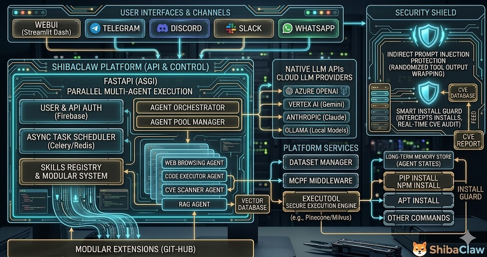

<p align="center">
  
</p>

<h1 align="center">ShibaClaw</h1>

<p align="center"><i>Agent IA self-hosted, incentrato sulla sicurezza, con interfaccia web integrata</i></p>

<p align="center">
  <a href="https://pypi.org/project/shibaclaw/"></a>
  <a href="https://pepy.tech/projects/shibaclaw"></a>
  
  <a href="https://github.com/RikyZ90/ShibaClaw/blob/main/LICENSE"></a>
  <a href="https://deepwiki.com/RikyZ90/ShibaClaw"></a>
</p>

<p align="center">
  <a href="#funzionalità">Funzionalità</a> ·
  <a href="#avvio-rapido">Avvio Rapido</a> ·
  <a href="#sicurezza">Sicurezza</a> ·
  <a href="#sistema-di-memoria">Memoria</a> ·
  <a href="#provider-supportati">Provider</a> ·
  <a href="#architettura">Architettura</a> ·
  <a href="#canali">Canali</a> ·
  <a href="#risoluzione-dei-problemi">Risoluzione dei problemi</a>
</p>

<p align="center">
  🌐 <a href="./README.zh-CN.md">简体中文</a> ·
  <a href="./README.es.md">Español</a> ·
  <a href="./README.pt-BR.md">Português (BR)</a> ·
  <a href="./README.ja.md">日本語</a> ·
  <a href="./README.de.md">Deutsch</a> ·
  <a href="./README.fr.md">Français</a> ·
  <a href="./README.it.md">Italiano</a>
</p>

---

<details open>
<summary>🚀 <b>Novità — Release cardine v1.0.0</b> (fai clic per espandere)</summary>

**Ultima release v1.0.0 (2026-09-08):**

- **Traguardo 1.0.0 — Framework di agenti pronto per la produzione** — ShibaClaw raggiunge la 1.0.0! Un assistente IA personale completo e self-hosted, progettato per privacy, modularità e massima stabilità, con pieno supporto a Python 3.12–3.14 e CI multipiattaforma Ubuntu/Windows.
- **Gestore memoria interattivo e quarantena in tempo reale** — Nuovo pannello dedicato nella WebUI (icona `psychology` nella barra laterale) ed endpoint REST (`/api/memory`). Ispeziona e modifica in tempo reale le conoscenze a lungo termine (`MEMORY.md`), le preferenze utente (`USER.md`), la cronologia della sessione (`HISTORY.md`) e le riflessioni del diario dei sogni (`DREAM_DIARY.md`), con monitoraggio in tempo reale del budget di token e redazione sicura degli elementi in quarantena.
- **UX interattiva durante il turno e Human-in-the-Loop di nuova generazione** — Interazione fluida durante i turni dell'agente: prompt strutturati a scelta multipla (`ask_user`), isolamento sicuro delle credenziali nel vault mascherato (`request_credential`, tenute rigorosamente fuori dal contesto LLM), schede di avanzamento visive persistenti (`update_progress`), ricerca rapida nelle sessioni (`session_search`) e permessi di sandbox dinamici per sessione (`full` | `workspace` | `readonly`).
- **Sicurezza rafforzata e sessioni in incognito a zero leak** — Scoping degli strumenti tramite `ContextVar` per singola esecuzione per prevenire leak di concorrenza tra sessioni diverse. Le sessioni in incognito eliminano completamente i log JSONL dal disco e ignorano il consolidamento della memoria. Whitelist restrittive dei modelli di profilo con blocco automatico in caso di errore (fail-closed) per impedire fallback non autorizzati.
- **Aggiornamento completo a LangChain 1.4+ e correzioni Dependabot** — Aggiornato l'intero stack RAG a LangChain 1.4+ moderno (`langchain>=1.4.0`, `langchain-core>=1.6.2`, `langchain-openai>=1.6.0`, `langchain-text-splitters>=1.1.2`), risolvendo tutti gli avvisi di sicurezza upstream noti (`pip-audit` pulito).
- **Pacchettizzazione modulare, `uv` e comando diagnostico Doctor** — Core engine snello con extra modulari (`[desktop]`, `[audit]`, `[rag]`, `[server]`, `[full]`), avvio in meno di un secondo con rilevamento lazy di plugin/canali e diagnostica `shibaclaw doctor [--fix]`.

Consulta [CHANGELOG.md](./CHANGELOG.md) per la cronologia completa delle versioni.

</details>

---

ShibaClaw è un agente IA self-hosted da eseguire sul proprio computer o server: un motore Python con interfaccia web integrata, supporto SDK nativo per 28 provider di modelli e 11 integrazioni per piattaforme di chat (Discord, Telegram, Slack, WhatsApp, Matrix e altre). È progettato attorno a tre priorità — semplicità, sicurezza e privacy — con protezioni come l'audit delle vulnerabilità CVE in fase di installazione, l'incapsulamento anti-prompt injection e la protezione SSRF integrate direttamente nel core invece di essere aggiunte come strumenti esterni posticci.

<p align="center">
  
  
</p>

> [!NOTE]
> Le note di rilascio si trovano in [CHANGELOG.md](./CHANGELOG.md).

## Funzionalità

- **Core incentrato sulla sicurezza** — vault di credenziali crittografato, audit CVE in fase di installazione, incapsulamento anti-prompt injection, protezione da SSRF/DNS-rebinding
- **Memoria a tre livelli e gestore WebUI** — memoria di lavoro, semantica (FAISS) e procedurale con gestione interattiva da WebUI, modifica in tempo reale, diario dei sogni e quarantena sicura
- **UX interattiva human-in-the-loop** — prompt strutturati durante il turno (`ask_user`), credenziali del vault mascherate, schede di avanzamento e sandbox dinamica dei permessi
- **28 provider, SDK nativi** — OpenAI, Anthropic, Gemini, DeepSeek e altri, senza alcun layer proxy LiteLLM
- **Web e mobile** — esponi la WebUI sulla tua rete locale (LAN) e usa lo stesso agente dallo smartphone
- **App desktop per Windows** — launcher nativo con integrazione nella barra delle applicazioni (system tray)
- **Pronto per MCP** — connetti qualsiasi server MCP, i tool vengono registrati automaticamente

## Avvio Rapido

**Requisiti:** Docker, oppure Python 3.12+ per la modalità pip. L'installer automatico per Windows non richiede nessuno dei due — include un'app desktop precompilata.

### Installer automatico (consigliato)

Un solo comando scarica l'ultima release, imposta i collegamenti e avvia l'interfaccia utente.

> [!TIP]
> Porta il tuo modello: connettiti a endpoint locali (Ollama, LM Studio) o sfrutta i piani gratuiti delle API tramite OpenRouter per iniziare a chattare a costo zero.

**🪟 Windows (PowerShell):**
```powershell
irm https://github.com/RikyZ90/ShibaClaw/releases/latest/download/install.ps1 | iex
```

**🐧 Linux / 🍎 macOS:**
```bash
curl -fsSL https://github.com/RikyZ90/ShibaClaw/releases/latest/download/install.sh | bash
```

> [!NOTE]
> Su Windows viene scaricata l'app desktop precompilata dall'ultima release di GitHub — nessun bisogno di Python, con collegamenti sul Desktop/Menu Start e disinstallazione pulita tramite App e funzionalità. Su Linux/macOS lo script effettua l'installazione tramite pip in un ambiente virtuale isolato.

### Docker

```bash
curl -fsSL https://raw.githubusercontent.com/RikyZ90/ShibaClaw/main/docker-compose.yml -o docker-compose.yml
docker compose up -d     # scarica da Docker Hub
docker exec -it shibaclaw-gateway shibaclaw print-token
```

Apri `http://localhost:3000`, incolla il token e segui la procedura guidata di onboarding. Esponi `shibaclaw-web` sulla tua LAN (ad es. tramite reverse proxy) per accedervi dal tuo smartphone.

### pip

```bash
pip install shibaclaw
shibaclaw web --with-gateway   # avvia la WebUI + il motore dell'agente sulla porta :3000
```

Apri `http://localhost:3000` e segui la procedura guidata di onboarding, oppure esegui `shibaclaw onboard` per la versione a riga di comando della medesima configurazione.

---

## Sicurezza

Le difese normalmente distribuite tra moduli applicativi o proxy esterni sono integrate nel core di ShibaClaw e attive per impostazione predefinita.

| Livello | Funzione |
|---|---|
| Audit in fase di installazione | Verifica `pip` e `npm` prima dell'esecuzione — blocca CVE critiche/alte |
| Incapsulamento prompt-injection e pre-scansione | Racchiude ogni output di tool in delimitatori randomizzati `<tool_output_...>`; pre-scansione regex anti-jailbreak |
| Rafforzamento della shell | Oltre 20 pattern bloccati, normalizzazione dei caratteri di escape, rilevamento URL interni |
| Motore local-first | L'emulatore di comandi nativo (`ls`, `cat`) azzera l'overhead dei sottoprocessi; fallback offline a `tiktoken` |
| Protezione di rete | Filtraggio SSRF, riconvalida dei reindirizzamenti, risoluzione sicura contro il DNS-rebinding |
| Sandbox del workspace | Strumenti di gestione file ed esploratore vincolati al workspace configurato |
| Controllo degli accessi | Autenticazione con Bearer token, verifiche a tempo costante, allowlist per i canali, rate limiting opzionale |
| Architettura distribuita | Interfaccia utente (~128 MB) separata dal cervello dell'agente (~256 MB+) |

Ogni output dei tool viene racchiuso in un delimitatore generato dinamicamente con un nonce casuale (es. `<tool_output_a1b2c3d4>`), in modo tale che un utente malintenzionato non possa chiudere prematuramente il tag né iniettare false istruzioni di sistema tramite l'output dei tool — il delimitatore è del tutto imprevedibile per sessione.

> [!TIP]
> Questo meccanismo di incapsulamento è disponibile anche come libreria standalone: [Muzzle](https://github.com/RikyZ90/Muzzle), una libreria Python priva di dipendenze integrabile in qualsiasi framework di agenti (LangChain, LlamaIndex, CrewAI, AutoGen o loop personalizzati).

## Sistema di Memoria

ShibaClaw adotta un'architettura di memoria a tre livelli:

1. **Memoria di lavoro** (per sessione) — contesto a scorrimento con riassunto automatico e troncamento intelligente basato sui token
2. **Memoria semantica** (cross-session) — archivio vettoriale FAISS + sentence-transformers con estrazione automatica dei fatti e ricerca semantica
3. **Memoria procedurale** (skill e automazioni) — flussi di lavoro appresi salvati come skill riutilizzabili, oltre a pianificazioni in stile cron

L'apprendimento proattivo estrae e salva automaticamente i fatti utili, l'auto-compattazione previene lo sforamento del contesto e le sessioni vengono archiviate in formato JSONL append-only per un logging veloce e memory-friendly.

## MCP e Integrazioni

ShibaClaw supporta il Model Context Protocol, potendosi connettere a qualsiasi server compatibile con MCP — Google Drive, Slack, GitHub, PostgreSQL e altri — senza dover modificare il codice di base. Configura i server direttamente dal pannello Impostazioni.

Per i servizi SaaS più diffusi (Gmail, Google Drive, Slack, GitHub, Outlook...), ShibaClaw si integra con [Klavis](https://klavis.ai): un'unica chiave API consente connessioni OAuth con un clic invece di dover registrare manualmente un'applicazione OAuth presso ogni singolo provider. Le applicazioni collegate vengono registrate automaticamente come server MCP nella sessione attiva.

## Provider Supportati

ShibaClaw utilizza SDK nativi — nessun layer proxy LiteLLM — e risolve il provider a partire dal modello selezionato o dall'ID modello con prefisso del provider. Tutti i cataloghi di provider configurati sono unificati in un unico elenco ricercabile nella WebUI.

**Chiave API**

| Provider | Variabile d'ambiente |
|---|---|
| OpenAI | `OPENAI_API_KEY` |
| Anthropic | `ANTHROPIC_API_KEY` |
| DeepSeek | `DEEPSEEK_API_KEY` |
| Google Gemini | `GEMINI_API_KEY`¹ |
| Groq | `GROQ_API_KEY` |
| Moonshot | `MOONSHOT_API_KEY` |
| MiniMax | `MINIMAX_API_KEY` |
| Zhipu AI | `ZAI_API_KEY` |
| DashScope | `DASHSCOPE_API_KEY` |

¹ È sufficiente impostare `GEMINI_API_KEY` — l'endpoint compatibile con OpenAI è già preconfigurato.

**Gateway / proxy** — OpenRouter, AiHubMix, SiliconFlow, VolcEngine, BytePlus, rilevati automaticamente dal prefisso della chiave o da `api_base`.

**Locale** — Ollama, LM Studio, llama.cpp, vLLM o qualsiasi endpoint compatibile con OpenAI.

> [!NOTE]
> In Docker, `localhost` punta all'interno del container. Per raggiungere un server locale in esecuzione sull'host (LM Studio, Ollama), usa `http://host.docker.internal:PORT` su Windows/macOS oppure `http://172.17.0.1:PORT` su Linux nativo.

**OAuth**

| Provider | Flusso | Configurazione |
|----------|--------|----------------|
| OpenRouter | Flusso browser PKCE, memorizza la chiave API restituita nella configurazione del provider | Impostazioni WebUI |
| GitHub Copilot | Flusso device, refresh automatico del token | `shibaclaw provider login github-copilot` o Impostazioni WebUI |
| OpenAI Codex | Flusso browser PKCE | `shibaclaw provider login openai-codex` o Impostazioni WebUI |
| Google Gemini CLI | Flusso browser PKCE, richiede le variabili d'ambiente `SHIBACLAW_GEMINI_OAUTH_CLIENT_ID` e `SHIBACLAW_GEMINI_OAUTH_CLIENT_SECRET`. **Nota:** Integrazione di terze parti non ufficiale; Google potrebbe applicare restrizioni sull'account. Usa un account dedicato se questo è un problema. | Impostazioni WebUI |

Per OpenRouter, il callback riutilizza l'URL e la porta attuali della WebUI come impostazione predefinita, per cui `http://localhost:3000` non è una porta dedicata esclusivamente a OAuth. Se esponi la WebUI dietro un reverse proxy o necessiti di un'origine pubblica di callback differente, imposta `SHIBACLAW_OPENROUTER_CALLBACK_BASE_URL=https://tuo-host-webui-pubblico` prima di avviare il server.

### 💡 Consiglio Pro: Modelli convenienti e di fascia alta

ShibaClaw offre prestazioni straordinarie anche senza spendere per le API:
- **Modelli Free/Open:** Consigliamo vivamente di usare **OpenRouter** per accedere a potenti modelli gratuiti come `nvidia/nemotron-3-super-120b-a12b:free` o `gemma-4-31b-it:free`.
- **Premium illimitato:** Usando l'integrazione OAuth con **GitHub Copilot**, ottieni l'accesso a modelli di fascia alta come `raptor` (`oswe-vscode-prime`) a costo zero, ottenendo di fatto richieste illimitate.

***

## 📊 Confronto con altre soluzioni (Security-First)

> [!NOTE]
> Il callback OAuth di OpenRouter riutilizza l'URL e la porta attuali della WebUI. Dietro un reverse proxy, imposta `SHIBACLAW_OPENROUTER_CALLBACK_BASE_URL` prima di avviare il server.

Per un utilizzo a costo zero, sia il piano gratuito di OpenRouter (ad es. `nvidia/nemotron-3-super-120b-a12b:free`) sia l'integrazione OAuth di GitHub Copilot (accesso illimitato a modelli come `raptor`) funzionano egregiamente senza richiedere una chiave API a pagamento.

## Architettura

<p align="center">
  
</p>

**Docker Compose**

| Servizio | Ruolo | Porta predefinita |
|---|---|---|
| `shibaclaw-gateway` | Core loop dell'agente, message bus, integrazioni canali | 19999 (HTTP) · 19998 (WS) |
| `shibaclaw-web` | WebUI (Starlette + WebSocket), servizio di automazione | 3000 |

Entrambi condividono il volume `~/.shibaclaw/` (configurazione, workspace, memoria, job di automazione, cache multimediale). Il comando `shibaclaw web` da solo esegue agente + WebUI + automazioni in un unico processo, senza necessità del container gateway.

**Stack** — Uvicorn/Starlette (ASGI), WebSocket nativi, frontend in vanilla JS + Marked.js + Highlight.js, sessioni append-only in formato JSONL.

**Consumo risorse** — ~120 MB in idle / ~350 MB di picco per componente (gateway, WebUI). Docker Compose limita ogni container a 512 MB con 256 MB di memoria riservata; l'output dei tool viene inviato in streaming con buffer limitati per evitare che comandi a lunga durata saturino la memoria.

## Riferimento CLI

```bash
shibaclaw web               # Avvia la WebUI (agente + automazioni in-process)
shibaclaw gateway           # Avvia solo il gateway (per architettura Docker separata)
shibaclaw onboard           # Procedura guidata di configurazione iniziale via CLI
shibaclaw agent -m "Ciao"   # Messaggio one-shot da terminale
shibaclaw agent             # REPL interattivo con cronologia
shibaclaw status            # Verifica stato provider, workspace e salute OAuth
shibaclaw print-token       # Mostra il token di autenticazione WebUI
shibaclaw channels status   # Elenca i canali abilitati
shibaclaw provider login <p># Login OAuth (github-copilot, openai-codex)
shibaclaw desktop           # Avvia l'app desktop per Windows
```

## Canali

| Canale | Tipo | Note |
|---|---|---|
| WebUI | Integrato | Interfaccia primaria, accesso completo a tutte le funzionalità |
| Discord | Bot | Embed avanzati, comandi slash, allegati |
| Telegram | Bot | Tastiere inline, file multimediali, markup risposte |
| WhatsApp | Plugin | Tramite WhatsApp Web |
| Slack | Bot | Block kit, thread, menzioni dell'app |
| DingTalk | Bot | Messaggistica aziendale |
| Feishu/Lark | Bot | Schede ricche, elementi interattivi |
| QQ | Bot | Messaggi di gruppo e privati |
| WeCom | Bot | Comunicazione aziendale |
| Matrix | Bot | Decentralizzato, crittografia end-to-end (E2E) |
| MoChat | Bot | Ecosistema WeChat |

Ciascun canale è configurabile indipendentemente nelle Impostazioni della WebUI e supporta il ricaricamento a caldo (hot-reload) alle modifiche della configurazione.

## Sistema di Plugin

ShibaClaw individua i plugin tramite gli entry point di Python:

- **Plugin di canale** — implementano `BaseChannel`, rilevabili tramite `shibaclaw.integrations`
- **Plugin TTS** — implementano `BaseTTS`, rilevabili tramite `shibaclaw.tts`

Integrati nativamente: `shibaclaw-channel-whatsapp` (WhatsApp Web) e `shibaclaw-tts-supertonic` (sintesi vocale ONNX offline e gratuita, 31 lingue). Installa o rimuovi i plugin da Impostazioni WebUI > Plugin, con supporto a hot-reload e blocco delle versioni. Consulta [`docs/PLUGINS_DEVELOPMENT_GUIDE.md`](./docs/PLUGINS_DEVELOPMENT_GUIDE.md) per crearne uno personalizzato.

## Sintesi Vocale (TTS)

Il motore Supertonic integrato funziona offline su ONNX (nessuna dipendenza da PyTorch, solo CPU), supporta 31 lingue con profili voce `F1`/`M1` e velocità regolabile, riproducendo l'audio tramite un widget integrato nel browser. Abilitalo in Impostazioni WebUI > TTS.

## Automazione e Pianificazione

I task in background vengono eseguiti secondo pianificazioni in stile cron o trigger guidati da eventi (messaggi, webhook, eventi di sistema), in sessioni isolate che non inquinano la cronologia della chat. Gestisci, monitora e consulta i log dal pannello Automazioni; i job persistono anche tra i riavvii grazie allo storage JSONL.

## Base di Conoscenza (RAG)

Retrieval-Augmented Generation locale e incentrata sulla privacy: organizza i documenti in collezioni denominate (PDF, CSV, HTML, TXT, Markdown), carica i file tramite trascinamento (drag-and-drop) ed effettua ricerche con un indice FAISS basato sugli embedding `all-MiniLM-L6-v2`. L'agente può invocare `knowledge_search` durante la conversazione, oppure puoi interrogare direttamente una collezione specifica con `@kb:nome`. Si tratta di una dipendenza opzionale — installabile con `pip install shibaclaw[rag]`.

## Risoluzione dei Problemi

| Problema | Soluzione |
|---|---|
| Controllo generale dello stato | `shibaclaw status` |
| Log dei container | `docker logs shibaclaw-gateway` / `docker logs shibaclaw-web` |
| La WebUI non si connette | Controlla il token con `shibaclaw print-token`, verifica il binding della porta |
| Errori del provider | `shibaclaw status` mostra la chiave API e lo stato OAuth |
| Accesso non riuscito dopo aggiornamento da v0.9.5 | Esegui `shibaclaw reset-admin` |
| Politica di sicurezza | [`SECURITY.md`](./SECURITY.md) |

---

<p align="center">
Consulta <a href="./CONTRIBUTING.md">CONTRIBUTING.md</a> per contribuire e <a href="./CHANGELOG.md">CHANGELOG.md</a> per la cronologia delle versioni.
</p>
