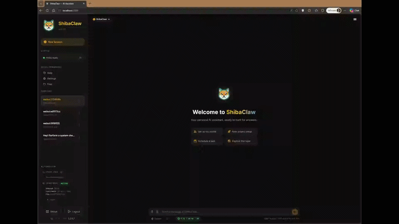
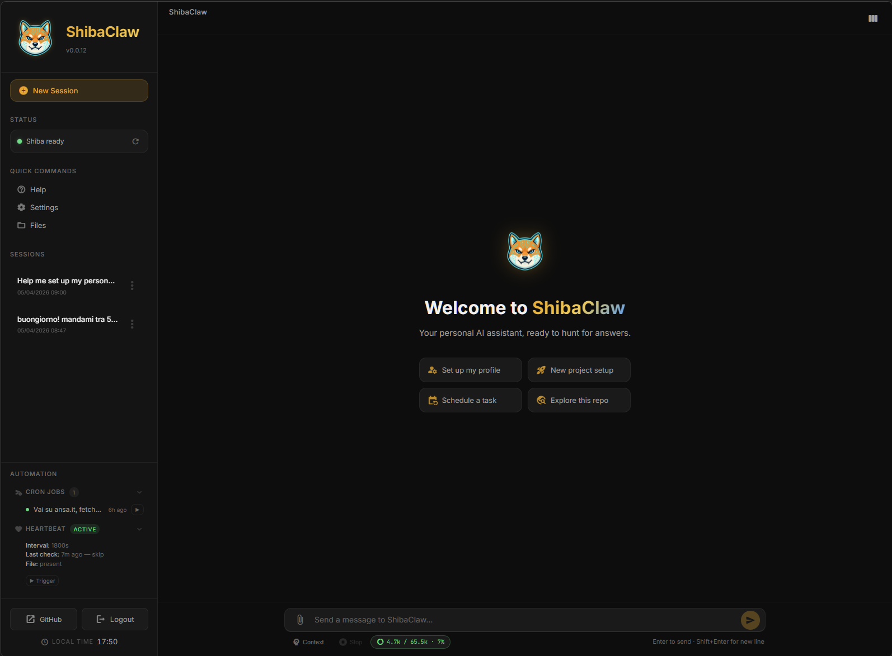
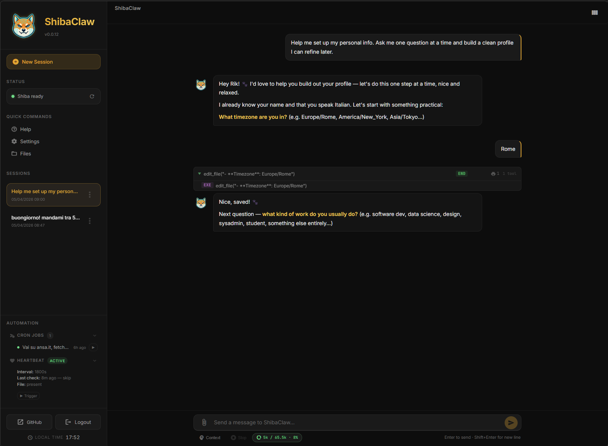
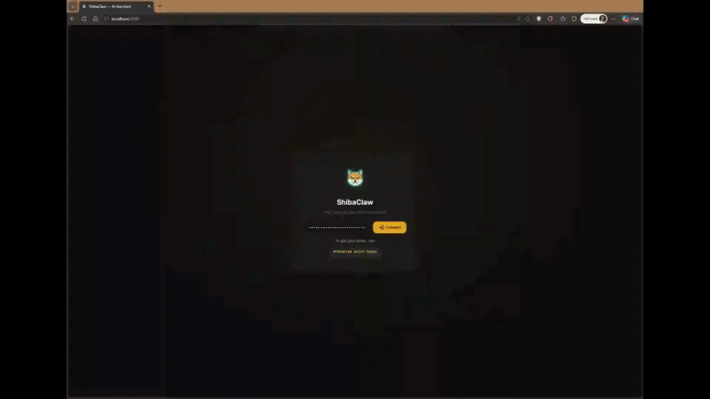

<p align="center">
  
</p>

<h1 align="center">ShibaClaw 🐕</h1>
<h3 align="center">Security-first AI agent with built-in WebUI, native provider support, and hardened tools.</h3>

<p align="center">
  <a href="https://pypi.org/project/shibaclaw/"></a>   
  <a href="https://pepy.tech/projects/shibaclaw"></a>
  
  <a href="https://github.com/RikyZ90/ShibaClaw/blob/main/LICENSE"></a>
  <a href="https://deepwiki.com/RikyZ90/ShibaClaw"></a>
</p>

---

📢 **Welcome to ShibaClaw v0.3.7!** This release adds a brand new **Dedicated Heartbeat Settings Tab**, supporting per-service model overrides, agent profile selection, and dynamic channel routing. It also includes the Native Windows Desktop App, cross-provider model search, and OpenRouter OAuth.
See the [Changelog](./CHANGELOG.md) for details.

---

ShibaClaw is a **security-first AI agent** for your terminal, desktop, browser and 11 other channels.
Security isn’t an add-on — it's the foundation: CVE auditing at install time, prompt-injection wrapping on every tool result, SSRF/DNS-rebinding protection, shell hardening, workspace sandboxing, and bearer-token auth are all built into the core.

---

## Why ShibaClaw? Simply Works. 🐕

> **Have you ever spent hours fixing your AI agent instead of actually using it?**
> ShibaClaw is built around one idea: your agent should just work — securely, reliably, and without babysitting.

Built on three pillars: **Simplicity · Security · Privacy**

### What makes ShibaClaw different

| Feature | ShibaClaw | OpenClaw | ZeroClaw | Nanobot | Hermes Agent |
|---|---|---|---|---|---|
| Security-first by design — not a plugin | ✅ | ❌ | ❌ | ❌ | ❌ |
| Install-time CVE auditing (pip, npm, apt) | ✅ | ❌ | ❌ | ❌ | ❌ |
| Prompt-injection wrapping on every tool result | ✅ | ❌ | ❌ | ❌ | ❌ |
| Native Windows Desktop App (no WSL2 needed) | ✅ | ❌ | ❌ | ❌ | ❌ |
| 3-level structured memory | ✅ | ❌ | ❌ | ❌ | ❌ |
| Per-session model selection + cross-provider search | ✅ | ❌ | ❌ | ❌ | ❌ |
| Dedicated memory consolidation model (separate budget) | ✅ | ❌ | ❌ | ❌ | ❌ |
| Shell hardening with 20+ deny-pattern guards | ✅ | ❌ | ❌ | ❌ | ❌ |
| SSRF + DNS-rebinding protection built-in | ✅ | ❌ | ❌ | ❌ | ❌ |

**Also ships with:** 22 providers · 11 chat channels · built-in WebUI · cron · heartbeat · MCP · 8 skills · Agent Profiles

---

## Native Desktop App (Windows) 🖥️

ShibaClaw now features a fully integrated **Windows Desktop Launcher** built with `pywebview`. 
It offers a seamless local experience without the need to manage background terminal windows.

- **System Tray Integration**: Close the window to minimize ShibaClaw silently into the system tray. Right-click the Shiba icon to re-open the UI, access workspace logs, visit the website, or gracefully quit the engine.
- **Auto-Login**: When using the Desktop Launcher locally, WebUI authentication is bypassed by default for a smoother local-first experience.
- **Embedded WebUI**: No need to open your own browser; the WebUI runs inside a dedicated native window frame.
- **Portable & Lightweight**: Packaged as a single standalone folder using PyInstaller to run instantly without requiring Python on the host machine.

If you installed via `pip`:
```bash
shibaclaw desktop
```

Or download the pre-built Windows executable directly from the latest release:

> **[⬇ Download ShibaClaw.exe (latest)](https://github.com/RikyZ90/ShibaClaw/releases/latest/download/ShibaClaw-windows.zip)**  
> Full release notes → [github.com/RikyZ90/ShibaClaw/releases/latest](https://github.com/RikyZ90/ShibaClaw/releases/latest)

---

## Quick Start

### Docker

```bash
curl -fsSL https://raw.githubusercontent.com/RikyZ90/ShibaClaw/main/docker-compose.yml -o docker-compose.yml
docker compose up -d     # pulls from Docker Hub
docker exec -it shibaclaw-gateway shibaclaw print-token
```

Open **http://localhost:3000**, paste the token, and follow the onboard wizard.

### pip

```bash
pip install shibaclaw
shibaclaw web --with-gateway   # starts WebUI + agent engine on :3000
```

Open **http://localhost:3000** and follow the onboard wizard.
Prefer the CLI? `shibaclaw onboard` runs the same guided setup from the terminal.

---

## Security, Built In

Defenses that are normally scattered across app glue or external proxies — in ShibaClaw they ship in the core, on by default.

### 🛡️ Prompt-Injection Wrapping (Tool Sandboxing)
Instead of simply feeding raw tool outputs back to the LLM, ShibaClaw wraps every tool result in a dynamically generated XML-like boundary with a randomized nonce (e.g., `<tool_output_a1b2c3d4>`). 
**Why this matters:** Attackers often try to prematurely close tags or inject fake system instructions inside tool outputs (like web page content). By using a randomized boundary generated per-iteration, the agent can reliably differentiate between actual system instructions and injected payloads. Furthermore, any attempt to inject the specific closing tag inside the content is automatically sanitized and escaped, ensuring the sandbox remains airtight and the original system prompt takes precedence.

### 🔍 Install-Time Package Autoscan
Before executing any `pip`, `npm`, or `apt` install command, ShibaClaw intercepts the action and parses the dependencies. It runs tools like `pip-audit` or `npm audit --json` to scan for known vulnerabilities against CVE databases before applying any changes.
**Why this matters:** It shifts security entirely to the left. Instead of blindly blocking package managers or relying on post-install scans, it evaluates the exact dependency tree *before* execution. If a package contains critical/high CVEs, or if suspicious flags (like `--allow-unauthenticated` for `apt`) are detected, the installation is blocked. This allows the AI to autonomously build software without turning the host into a liability.

### Security Layers Overview

| Layer | What it does |
|---|---|
| 🔍 Install-time audit | Audits `pip` and `npm` before execution — blocks critical/high CVEs before they land |
| 🛡️ Prompt-injection wrapping | Wraps every tool result in a randomized `<tool_output_...>` boundary and sanitizes closing tags |
| 🔒 Shell hardening | 20+ deny patterns, escape normalization (`\x..`, `\u....`), internal URL detection |
| 🌐 Network guard | SSRF filtering, redirect revalidation, DNS-rebinding-safe resolution |
| 📁 Workspace sandbox | File tools and file browser locked to the configured workspace |
| 🔑 Access control | Bearer token auth, constant-time checks, channel allowlists, optional rate limiting |
| ⚡ Distributed engine | UI (≈128 MB) decoupled from agent brain (≈256 MB+) — minimal footprint per process |

Full disclosure policy and supported versions: [SECURITY.md](./SECURITY.md)

---

## WebUI

<p align="center">
  
  &nbsp;&nbsp;
  
</p>

The WebUI is built-in — no separate frontend or Node.js required.

- **Chat** — multi-session conversations with live streaming of tool calls, thinking blocks, elapsed time, and per-session model switching from the chat footer
- **Cross-provider model search** — one searchable picker merges models from all configured providers, shows provider labels, and switches the live runtime provider when you change the session model
- **Agent Profiles** — switch personas per session (Hacker, Builder, Planner, Reviewer) with dynamic avatars
- **File browser** — browse, view, and edit workspace files in-browser (sandboxed to workspace)
- **Voice** — speech-to-text via OpenAI-compatible audio APIs and browser-native TTS
- **Settings** — configure default session model, memory / consolidation model, providers, tools, MCP servers, channels, skills, and OAuth from a single panel
- **Onboard wizard** — guided first-time setup: pick a provider, enter API key or start OAuth, choose a model
- **Context viewer** — inspect the full system prompt and token usage breakdown
- **Gateway monitor** — health check and one-click restart
- **OAuth flows** — GitHub Copilot, OpenAI Codex, and OpenRouter can all be configured from the settings modal; OpenRouter stores the returned API key directly into provider settings
- **Hardened rendering** — chat Markdown escapes raw HTML, file names render through safe DOM nodes, and expired auth returns cleanly to login without reconnect loops
- **Auto-update** — checks GitHub releases every 12h, notifies in the UI and on all active channels
- **Responsive** — works on desktop and mobile

### ⚡ Dynamic Model Selection

<p align="center">
  
</p>

**Change models per session** — no more single global model, but a flexible choice for every conversation.

- **Multi-Provider Search**: Search through all models from all your configured providers (OpenRouter, GitHub Copilot, Anthropic, etc.) in a single dropdown.
- **Session-Aware Routing**: Each session remembers its chosen model. You can have a coding session with `Claude 3.5 Sonnet` and a research session with `Gemma 4` simultaneously.
- **Runtime Switching**: Switch models instantly without restarting the agent; the gateway automatically resolves the correct endpoint based on the selected model.
- **Dedicated Memory Model**: Configure a separate model and provider specifically for memory consolidation and proactive learning, ensuring high-quality state extraction without affecting your chat budget.
- **Default-First**: New sessions automatically start with the default model set in settings, ensuring immediate consistency.

### Agent Profiles

<p align="center">
  
</p>

Switch the agent's personality on-the-fly without losing context. Each profile overrides the system prompt (SOUL.md) while keeping model, memory, and tools shared. Profiles are per-session — run a security audit in one tab and plan architecture in another.

**Built-in profiles:** Default · Builder · Planner · Reviewer · **Hacker** (elite security expert with 50+ tool recommendations, OWASP/MITRE/NIST methodologies, CVSS scoring, and a custom cyber-shiba avatar).

Create your own profiles interactively — the agent walks you through defining the persona and saves everything automatically.

---

## Features

### 🧠 Advanced 3-Level Memory System

ShibaClaw's memory isn't just a rolling chat buffer; it's a structured, proactive system designed for long-term operational continuity.

- **`USER.md` (Identity & Preferences):** Stores durable personal facts, communication styles, and language preferences. The agent reads this to know *who* you are.
- **`MEMORY.md` (Operational State):** The agent's working knowledge. It tracks environment details, recurring entities, and project state.
- **`HISTORY.md` (Session Archive):** An append-only, searchable ledger of past sessions with timestamped, tagged summaries.

**Why this matters:**
Instead of bloating the system prompt with thousands of messages, ShibaClaw features a **Proactive Learning loop**. Every N messages, a background LLM process silently extracts new durable facts and updates `USER.md` and `MEMORY.md`, without interrupting the conversation. When `MEMORY.md` grows too large, an auto-compaction routine summarizes and deduplicates the context, prioritizing recent state while keeping token usage within strict budgets. When the agent needs older context, it can autonomously search `HISTORY.md` using TF-IDF and recency scoring. This separation of concerns ensures the agent stays hyper-aware of the current project without ever hitting token limits or losing focus.

### Workflow & Reasoning

- **Model-first session routing** — each session stores its own selected model, and ShibaClaw resolves the correct provider backend from that model at runtime
- **Focused background delegation** — the `spawn` tool can offload a specific task and report back into the main session when done
- **Advanced reasoning** — supports extended thinking (Anthropic), reasoning effort (OpenAI o-series), and DeepSeek-R1 chains

### Tools

| Tool | What it does |
|------|-------------|
| `exec` | Shell commands with 20+ deny-pattern guards, encoding normalization, and CVE scanning |
| `read_file` / `write_file` / `edit_file` | Paginated reads, fuzzy find-and-replace, auto-created parent dirs |
| `web_search` | Brave, Tavily, SearXNG, Jina, or DuckDuckGo (fallback, no key needed) |
| `web_fetch` | HTTP fetch with SSRF protection, DNS rebinding defense, and redirect validation |
| `memory_search` | Ranked search over session history (TF-IDF + recency + importance scoring) |
| `message` | Cross-channel messaging with media attachments |
| `cron` | Schedule one-time or recurring jobs (cron expressions, intervals, ISO dates, timezone-aware) |
| `spawn` | Optional background worker for a focused task; reports back to the main session when done |
| MCP | Connect any MCP server (stdio, SSE, or streamable HTTP) — tools auto-registered as `mcp_<server>_<tool>` |

### Channels

Telegram · Discord · Slack · WhatsApp · Matrix · Email · DingTalk · Feishu · QQ · WeCom · MoChat

All channels route through the same message bus. WhatsApp uses a Node.js bridge (Baileys) for QR-based linking.

### Skills

8 built-in skills (GitHub, weather, summarize, tmux, cron reference, memory guide, skill-creator, ClawHub browser). Skills are Markdown files with YAML frontmatter and optional scripts — create your own or install from [ClawHub](https://clawhub.ai/). Pin frequently-used skills to load them on every conversation.

### Automation

- **Cron service** — persistent, timezone-aware scheduled jobs stored in `jobs.json`. Supports `every`, `cron`, and `at` schedules. Overdue jobs fire on startup.
- **Heartbeat** — periodic wake-up reads `HEARTBEAT.md`, uses its frontmatter for session/profile/targets, keeps enable/interval in global settings, skips the LLM entirely when `Active Tasks` is empty, and only asks the model to decide when real active work exists.

If you are upgrading from an older release, it is recommended to reset your workspace `HEARTBEAT.md` once so you get the new frontmatter-based base template. Existing files still work, but they will not gain the new editable settings block automatically.

---

## Supported Providers

ShibaClaw uses native SDKs (no LiteLLM proxy) and resolves the active provider from the selected model or canonical provider-prefixed model ID. In the WebUI, all configured provider catalogs are merged into a single searchable list, while each session keeps its own chosen model.

### API Key

| Provider | Env Variable |
|----------|-------------|
| OpenAI | `OPENAI_API_KEY` |
| Anthropic | `ANTHROPIC_API_KEY` |
| DeepSeek | `DEEPSEEK_API_KEY` |
| Google Gemini | `GEMINI_API_KEY` ¹ |
| Groq | `GROQ_API_KEY` |
| Moonshot | `MOONSHOT_API_KEY` |
| MiniMax | `MINIMAX_API_KEY` |
| Zhipu AI | `ZAI_API_KEY` |
| DashScope | `DASHSCOPE_API_KEY` |

¹ Setting `GEMINI_API_KEY` in the environment is sufficient — no stored key required. The Google OpenAI-compatible endpoint is pre-configured.

### Gateway / Proxy

OpenRouter · AiHubMix · SiliconFlow · VolcEngine · BytePlus — auto-detected by key prefix or `api_base`.

### Local

Ollama (`http://localhost:11434`) · LM Studio · llama.cpp · vLLM · any OpenAI-compatible endpoint(`http://localhost:1234/v1`)

> **Note for Docker users:** If you run ShibaClaw via Docker Compose, `localhost` points inside the container itself. To connect to a local server running on your host machine (like LM Studio or Ollama on Windows/Mac), use:
> `http://host.docker.internal:1234/v1` (or `11434` for Ollama). On native Linux, use `http://172.17.0.1:port`.

### OAuth

| Provider | Flow | Setup |
|----------|------|-------|
| OpenRouter | PKCE browser flow, stores returned API key in provider config | WebUI Settings |
| GitHub Copilot | Device flow, auto token refresh | `shibaclaw provider login github-copilot` or WebUI Settings |
| OpenAI Codex | PKCE browser flow | `shibaclaw provider login openai-codex` or WebUI Settings |

For OpenRouter, the callback reuses the current WebUI URL and port by default, so `http://localhost:3000` is not a dedicated OAuth-only port. If you expose the WebUI behind a reverse proxy or need a different public callback origin, set `SHIBACLAW_OPENROUTER_CALLBACK_BASE_URL=https://your-public-webui-host` before starting the server.

### 💡 Pro Tip: Cost-Effective & Premium Models

ShibaClaw performs exceptionally well even without expensive API usage:
- **Free/Open Models:** We highly recommend using **OpenRouter** to access powerful free models like `nvidia/nemotron-3-super-120b-a12b:free` or `gemma-4-31b-it:free`.
- **Unlimited Premium:** If you use the **GitHub Copilot** OAuth integration, you gain access to premium models like `raptor` (`oswe-vscode-prime`) at **zero additional cost**, effectively giving you unlimited requests.

---

## 🔌 MCP Ecosystem

ShibaClaw is fully compatible with the **Model Context Protocol (MCP)**, transforming the agent from a standalone tool into a plug-and-play AI hub. 

Instead of relying solely on built-in skills, ShibaClaw can connect to any MCP-compliant server, instantly granting your agent access to a vast universe of external data sources and professional tools without modifying a single line of core code.

**Why this matters:**
- **Instant Extensibility**: Plug in community-made MCP servers for Google Drive, Slack, GitHub, PostgreSQL, and more.
- **Standardized Tooling**: Leverage a universal protocol for AI-to-tool communication, ensuring stability and interoperability.
- **Decoupled Architecture**: Keep your agent lean while scaling its capabilities through a distributed network of MCP servers.

*Configure your MCP servers directly in the **Settings** panel to start expanding ShibaClaw's horizons.*

---

## Architecture

<p align="center">
  
</p>

### Docker Compose

| Service | Role | Default Port |
|---------|------|-------------|
| `shibaclaw-gateway` | Core agent loop, message bus, channel integrations | 19999 (HTTP) · 19998 (WS) |
| `shibaclaw-web` | WebUI (Starlette + native WebSocket), cron service | 3000 |

Both share the `~/.shibaclaw/` volume (config, workspace, memory, cron jobs, media cache).

### Single-process mode

`shibaclaw web` runs agent + WebUI + cron in a single process — no gateway container needed.

### Stack

| Layer | Technology |
|-------|-----------|
| Server | Uvicorn → Starlette (ASGI) |
| Real-time | Native WebSocket (`/ws` on WebUI, port `19998` on gateway) |
| Frontend | Vanilla JS · Marked.js · Highlight.js |
| Sessions | JSONL append-only per session (cache-friendly for LLM prompt prefixes) |

### Resource usage

| Component | Idle | Peak (install/compile) |
|-----------|------|------------------------|
| Gateway | ~120 MB | ~350 MB |
| WebUI | ~120 MB | ~350 MB |

Docker Compose sets a **512 MB** limit / **256 MB** reservation per container. Tool output is streamed with bounded buffers, so long-running commands (`apt`, `npm install`) can't blow up memory.

## CLI Reference

```bash
shibaclaw web               # Start WebUI (agent + cron in-process)
shibaclaw gateway            # Start gateway only (for Docker split)
shibaclaw onboard            # CLI-based first-time setup wizard
shibaclaw agent -m "Hello"   # One-shot message via terminal
shibaclaw agent              # Interactive REPL with history
shibaclaw status             # Provider, workspace, OAuth health check
shibaclaw print-token        # Show WebUI auth token
shibaclaw channels status    # List enabled channels
shibaclaw provider login <p> # OAuth login (github-copilot, openai-codex)
```

---

## [0.2.0] - 2026-05-02

### Added
- **Cross-provider model search** — Chat and settings now aggregate models from every configured provider into one searchable catalog with provider labels.
- **OpenRouter OAuth in WebUI** — Settings can launch a browser PKCE flow and save the returned OpenRouter API key automatically.

### Changed
- **Per-session model routing** — Each session now keeps its own model, and the gateway resolves the correct provider backend from that choice at runtime.
- **Model-first settings UX** — The Agent tab now focuses on default model and memory / consolidation model pickers instead of a static provider selector.

### Fixed
- **Model switching correctness** — Session metadata changes now stay in sync between WebUI and gateway, GitHub Copilot model discovery refreshes credentials correctly, and the model dropdown no longer renders with transparent backgrounds.

→ [Full changelog](./CHANGELOG.md)

---

## Troubleshooting

| Problem | Try |
|---------|-----|
| General status check | `shibaclaw status` |
| Container logs | `docker logs shibaclaw-gateway` / `docker logs shibaclaw-web` |
| WebUI won't connect | Check token with `shibaclaw print-token`, verify port binding |
| Provider errors | `shibaclaw status` shows API key and OAuth state |
| Security policy | [`SECURITY.md`](./SECURITY.md) |

---

## Contributing

See [`CONTRIBUTING.md`](./CONTRIBUTING.md) — PRs welcome.

Channels are extensible via Python entry points (`shibaclaw.integrations`). Skill creation is documented in [`docs/CHANNEL_PLUGIN_GUIDE.md`](./docs/CHANNEL_PLUGIN_GUIDE.md) and the built-in `skill-creator` skill.


---

### 🌟 Support ShibaClaw

If you find this project useful or if it helps you build a more secure and powerful AI workflow, please consider giving it a **Star**! 

Your support helps ShibaClaw grow, reach more developers, and stay updated with the latest AI advancements. Thank you for being part of the journey! ❤️


---

Inspired by [NanoBot](https://github.com/HKUDS/nanobot) by HKUDS — MIT License.

---

<p align="center">
  ⭐ <a href="https://github.com/RikyZ90/ShibaClaw">Star the repo</a> &nbsp;·&nbsp;
  🐛 <a href="https://github.com/RikyZ90/ShibaClaw/issues">Open an issue</a> &nbsp;·&nbsp;
  🔧 <a href="https://github.com/RikyZ90/ShibaClaw/pulls">Send a PR</a> &nbsp;·&nbsp;
  💬 <a href="https://discord.gg/kys6UYHmEb">Join the Discord</a>
</p>
