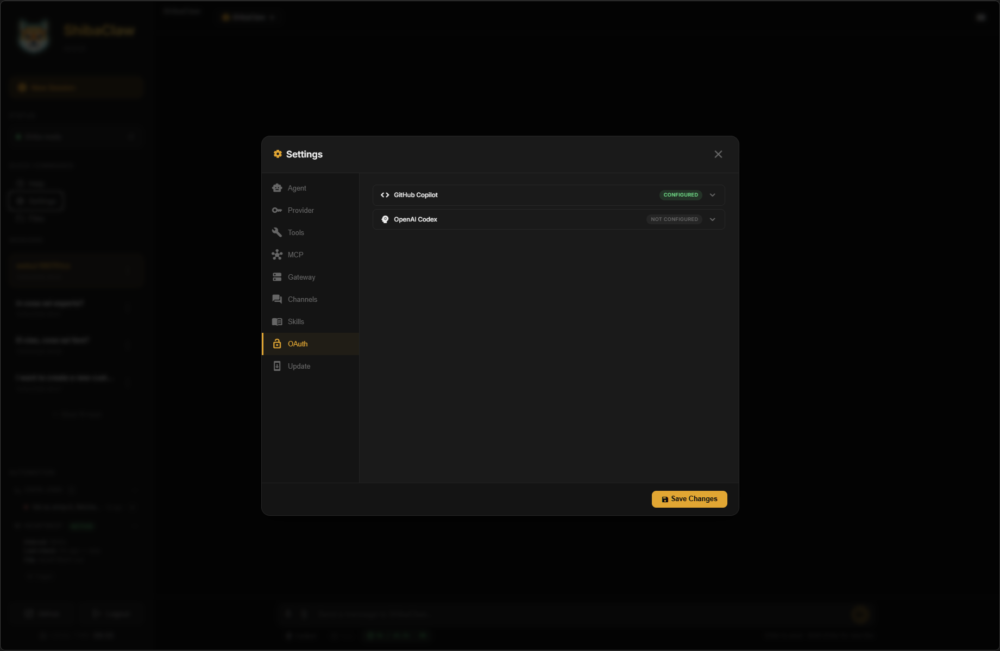

<p align="center">
  
</p>

# Smart. Loyal. Powerful. 🐕
<p align="center">
  <a href="https://github.com/RikyZ90/ShibaClaw/releases"></a>
  <a href="https://pepy.tech/projects/shibaclaw"></a>
  
  <a href="https://github.com/RikyZ90/ShibaClaw/blob/main/LICENSE"></a>
  <a href="https://deepwiki.com/RikyZ90/ShibaClaw"></a>
</p>

ShibaClaw is a **loyal, intelligent, and lightweight** personal AI assistant framework — built to serve and protect your digital workspace.

The **only** AI agent framework combining **extreme multi-layer security** (Structural Tool Output Wrapping against Prompt Injection + Smart Install Guard with live CVE scanning before every package install) with **minimal token consumption**, keeping your costs low without sacrificing power.

**🛡️ Built-in Security**: Protected against Indirect Prompt Injection via **Structural Randomized Wrapping** and strict per-session security policies.

---

## 📢 News

> **v0.0.16** is out! Standalone mode stability and health check fixes

- **2026-04-07** 🐕 **Standalone Mode Reliability** — Fixed false "Gateway Down" in bare-metal standalone mode (`shibaclaw web`). The health check and heartbeat services now correctly fall back to the local agent instance when a separate gateway process is not present.
- **2026-04-06** 🛡️ **Security Hardening** — Socket.IO auth bypass fixed, auth token leakage in URLs prevented, SSRF mitigation in update manifest validation, constant-time token comparison, race condition in task callback resolved, severity comparison logic corrected.
- **2026-04-05** 🚀 **Guided Onboarding Everywhere** — `shibaclaw onboard` now drives a single guided setup flow across CLI and WebUI: provider detection, OAuth handoff, model selection, template refresh, and optional channel setup.
- **2026-04-05** 🧠 **Smarter Persistent Memory** — Durable personal data now lives in `USER.md`, operational context lives in `memory/MEMORY.md`, and the new `memory_search` tool ranks `HISTORY.md` entries by recency, importance, and relevance.
- **2026-04-05** ⏰ **Reliable Automation Runtime** — Cron jobs now keep stable session targets, overdue one-shot jobs fire on startup, and the WebUI owns cron execution so Docker no longer races on shared schedules.
- **2026-04-05** 📡 **Automation Sidebar** — The WebUI sidebar now shows live cron jobs and heartbeat telemetry, with manual trigger controls for both.
- **2026-04-04** 🛡️**Telegram** Policy applied uniformly across all four entry points: reject early, expose nothing. Unauthorised senders receive no response, no typing indicator, and no information about the bot's existence.
- **2026-04-03** 🔄 **Update Notifications** — A new **Update** tab in Settings shows the current vs latest version, and active channels (Telegram, Discord, ...) receive an automatic notification with ready-to-copy `pip` / `docker` upgrade commands.
- **2026-04-03** 📦 **Available on PyPI & Docker** — Install in one line: `pip install shibaclaw`. Docker images are published automatically on every release to `ghcr.io/rikyz90/shibaclaw`.
- **2026-04-01** 📂 **Integrated File Browser** — A full file explorer in the WebUI sidebar: browse, view, edit and save workspace files directly from the browser. Path-traversal protected and workspace-sandboxed.
- **2026-04-01** 📎 **File Attachments & Images** — Drag-and-drop or paste files and images directly into the chat. Images are previewed inline; other files are streamed to the agent as context.
- **2026-04-01** 🧹 **Security Hardening & Cleanup** — Full production audit: 14 bugs fixed across asyncio locking, path traversal, CORS misconfiguration, unicode injection, pip-audit parsing, and TCP resource leaks.
- **2026-04-01** 🧠 **Proactive Learning (Scent Mining)** — The agent periodically reflects on your conversation in the background, updating your personal profile in `USER.md` and operational context in `memory/MEMORY.md` without any interruption.
- **2026-03-31** 🔍 **Smart Install Guard** — Package installs (`pip`, `npm`, `apt`, ...) are intercepted and audited for CVEs before execution. Critical/high severity packages are blocked with a full report; clean packages install freely.
- **2026-03-29** 🛡️ **Security & Core Modernization** — Enhanced **Indirect Prompt Injection** protection via **Randomized Tool Output Wrapping**: every tool response is enclosed in a dynamic per-session nonce boundary, so malicious instructions embedded in external data (web pages, files, API responses) cannot hijack the agent. LiteLLM fully removed in favor of native SDKs (`openai`, `anthropic`) for leaner images and stricter control. GitHub Copilot OAuth rewritten with raw async device flow for stable background token refresh. Shell tool hardened against `$()`, backticks, piped shells (`curl | bash`), and process substitution. Gateway restart endpoint secured with token-based auth.
- **2026-03-22** 🧩 **Settings & WebUI Overhaul** — Tabbed settings modal, real-time Socket.IO streaming with process groups, Jupyter-style token auth, OAuth login directly from the browser, and interactive onboard wizard.

---

## 🐾 Key Features
- **Fast & Faithful**: Minimal startup time and dependencies.
- **📢 Multi-channel**: Support for Telegram, Discord, Slack, WhatsApp, Matrix, and more.
- **⏰ Always Alert**: Built-in cron and heartbeat task scheduler.
- 🧩 **Skills Registry**: Modular and extensible skill system with native ClawHub marketplace support
- ⚡ **Parallel Multi-Agent Execution**: A built-in fan-out orchestration model that spawns and coordinates specialized sub-agents concurrently for faster, scalable task resolution
- **Advanced Thinking**: Support for OpenAI, Azure, and deep-reasoning thinkers.
- **🛡️ Built-in Security**: Protected against Indirect Prompt Injection via **Structural Randomized Wrapping** and strict per-session security policies.
- **🔍 Smart Install Guard**: Package installs are audited for CVEs before execution — safe packages install freely, vulnerable ones are blocked with a full CVE report.
- **🧠 Proactive Learning (Scent Mining)**: Periodic background analysis of the active conversation to persist personal profile updates in `USER.md` and operational context in `memory/MEMORY.md`, ensuring no "scent" is lost even in long sessions.
- **📂 Integrated File Browser**: Browse, view, edit and save workspace files directly from the WebUI — no terminal needed.
- **📎 File Attachments & Images**: Drag-and-drop or paste files and images directly into the chat for the agent to use as context.
- **🔄 Auto Update Check**: Periodic GitHub release monitoring every 12 hours — notifies via WebUI **and** active channels with ready-to-copy upgrade commands.

## 🔒 Loyal Only to You
Like the most devoted guard dog, ShibaClaw is trained to obey only its master. Thanks to its advanced **Tool Output Wrapping** system, the framework is hardened against *Indirect Prompt Injection* attacks. It treats external data from websites, files, or tools as literal information—never as new instructions. Your orders are final; to ShibaClaw, external noise is just a squirrel 🐿️.

## 🔍 Smart Install Guard

When the agent attempts to run a package installation command, ShibaClaw no longer blindly blocks it. Instead, it **intercepts the command, audits the packages for known vulnerabilities (CVEs), and only proceeds if the risk is acceptable**.

### How It Works

1. **Detect** — The `ExecTool` recognizes install commands for `pip`, `npm`, `yarn`, `pnpm`, `apt`, `dnf`/`yum`, and `brew`.
2. **Audit** — Before execution, the packages are scanned:
   - **Python (`pip install ...`)** → `pip-audit --format json` checks against the OSV/PyPA advisory database.
   - **Node.js (`npm install ...`)** → `npm audit --json` checks against the npm security advisory database.
   - **System packages (`apt`/`dnf`)** → Safety flags (e.g. `--allow-unauthenticated`, `--nogpgcheck`) are checked; repository-level security is assumed.
   - **Homebrew** → Allowed with medium confidence (curated formulae).
3. **Decide** — Based on the configured severity threshold:
   - `critical` or `high` vulnerabilities → **install is blocked** and the agent receives a full CVE report.
   - `medium` or `low` vulnerabilities → **install proceeds** with a warning appended to the output.
   - No vulnerabilities → **install proceeds** cleanly.
4. **Fallback** — If audit tools are unavailable (no internet, `pip-audit` not installed), the install is **allowed with a warning** rather than blocked.

> **Destructive operations** (`pip uninstall`, `npm remove`, `apt-get remove`, `apt-get purge`) remain unconditionally blocked.
### Configuration

In `config.json` under `tools.exec`:

```json
{
  "tools": {
    "exec": {
      "installAudit": true,
      "installAuditTimeout": 120,
      "installAuditBlockSeverity": "high"
    }
  }
}
```

| Option | Default | Description |
|--------|---------|-------------|
| `installAudit` | `true` | Enable/disable vulnerability scanning for installs |
| `installAuditTimeout` | `120` | Seconds to wait for audit tools before falling back |
| `installAuditBlockSeverity` | `"high"` | Minimum severity to block: `critical`, `high`, `medium`, `low` |

---

## 🧠 Proactive Learning (Scent Mining)

ShibaClaw won't wait for your session to end or the context window to fill to remember important details. With **Proactive Learning**, the agent periodically "sniffs" the recent conversation in the background to extract profile facts and project context.

### How It Works

1. **Pulse** — Every 10 messages (default), a background task is triggered.
2. **Reflect** — A specialized mini-LLM call analyzes the recent history since the last pulse.
3. **Persist** — Personal facts and preferences are merged into `USER.md`, while environment details and project status are merged into `memory/MEMORY.md`.
4. **Zero Latency** — The learning process runs asynchronously via `_schedule_background`. You can continue chatting without any interruption.

### Configuration

In `config.json` under `agents.defaults`:

```json
{
  "agents": {
    "defaults": {
      "learning_enabled": true,
      "learning_interval": 10
    }
  }
}
```

| Option | Default | Description |
|--------|---------|-------------|
| `learning_enabled` | `true` | Enable periodic background fact extraction |
| `learning_interval` | `10` | Number of messages between learning pulses |

---

## 🐾 Quick Start

Ready to hunt? Choose your path:

### 🐋 Docker (Recommended)
```bash
# Optional: define a fixed WebUI token before startup
# .env
# SHIBACLAW_AUTH_TOKEN=your-secret-token

docker compose up -d --build                             # gateway + webUI
docker exec -it shibaclaw-gateway shibaclaw onboard      # first-time setup
```

> 🔒 **Security Note**: By default, the app is bound to `localhost` (via `127.0.0.1:3000:3000`).
> - **Remote Access (Recommended)**: Use an SSH tunnel (e.g., `ssh -L 3000:127.0.0.1:3000 user@host`).
> - **Direct LAN Access**: Change `127.0.0.1:3000:3000` to `3000:3000` in `docker-compose.yml`.
Open **http://localhost:3000** — to get your access token, run `shibaclaw print-token` and paste it in the login screen.

If `SHIBACLAW_AUTH_TOKEN` is set in your shell or `.env`, that value is used as the WebUI token and takes precedence over the auto-generated `auth_token` file.

### 🐍 Bare Metal
```bash
pip install shibaclaw
shibaclaw onboard                # first-time setup
shibaclaw web --port 3000        # start the WebUI (agent runs in-process)
```

> � **Standalone Mode**: In bare-metal mode, `shibaclaw web` runs the agent brain internally. You don't need to run a separate `shibaclaw gateway` unless you want to bridge other channels (Telegram, Discord, etc.) while the WebUI is down.

> �🔒 **Security Note**: By default, the app binds to `localhost`.
> - **Remote Access (Recommended)**: Use an SSH tunnel (e.g., `ssh -L 3000:127.0.0.1:3000 user@host`).
> - **Direct LAN Access**: Run `shibaclaw web --host 0.0.0.0`.

Optional fixed token:

```bash
export SHIBACLAW_AUTH_TOKEN=your-secret-token
shibaclaw web --port 3000
```

> Install from source: `pip install .` (develop/edge builds)

See the full [Easy Deploy Guide](./deploy_guide.md) for detailed instructions and troubleshooting.

## 🖥️ WebUI

<p align="center">
  &nbsp;&nbsp;
  
  
</p>

### Features at a Glance

- **🔐 Token authentication** — auto-generated access token printed at startup (disable with `SHIBACLAW_AUTH=false`)
- **Multi-session chat** — create, rename, archive, and switch between conversations
- **Live process groups** — watch agent reasoning and tool calls stream in with elapsed time
- **Settings modal** — configure model, provider, API keys, tools, gateway, channels, and OAuth providers
- **OAuth login from UI** — authenticate GitHub Copilot and OpenAI Codex directly from the Settings panel
- **Context viewer** — inspect workspace context and token usage
- **Gateway monitor** — health check and one-click restart of the core AI engine
- **Typing indicator** — animated feedback while the agent is working
- **Responsive** — works on desktop and mobile

### Architecture

| Layer | Stack |
|-------|-------|
| **Server** | Uvicorn → Starlette (ASGI) + python-socketio |
| **Real-time** | Socket.IO 4.7.5 (WebSocket, polling fallback) |
| **Frontend** | Vanilla JS · Marked.js · Highlight.js (github-dark) |

| Container | Command | Port | Role |
|-----------|---------|------|------|
| `shibaclaw-gateway` | `shibaclaw gateway` | 19999 | Core AI loop + message bus |
| `shibaclaw-web` | `shibaclaw web --port 3000` | 3000 | WebUI (Starlette + Socket.IO) |

Both containers share the `.shibaclaw/` volume for config, workspace, tools, and cache.
Scheduled jobs (cron) are executed exclusively by the WebUI container.

### Resource Footprint

Approximate idle RAM usage in Docker:

| Component | RAM |
|-----------|-----|
| `shibaclaw-gateway` | <200 MB |
| `shibaclaw-web` | <200 MB |

Values are indicative and can vary with model load, active sessions, and container runtime.

## 🧩 Supported Providers

ShibaClaw includes a unified provider registry and supports a wide range of LLM backends.

### 🔑 API key-based providers
- OpenAI (`OPENAI_API_KEY`)
- Anthropic (`ANTHROPIC_API_KEY`)
- DeepSeek (`DEEPSEEK_API_KEY`)
- Gemini (`GEMINI_API_KEY`)
- Zhipu AI (`ZAI_API_KEY`, `ZHIPUAI_API_KEY`)
- DashScope (`DASHSCOPE_API_KEY`)
- Moonshot (`MOONSHOT_API_KEY`, `MOONSHOT_API_BASE`)
- MiniMax (`MINIMAX_API_KEY`)
- Groq (`GROQ_API_KEY`)

### 🔗 Gateway providers (auto-detected by key prefix / api_base)
- OpenRouter (`OPENROUTER_API_KEY`, auto key prefix `sk-or-`, base `openrouter`)
- AiHubMix (`OPENAI_API_KEY`, base `aihubmix`)
- SiliconFlow (`OPENAI_API_KEY`, base `siliconflow`)
- VolcEngine / BytePlus / Coding Plans (`OPENAI_API_KEY` + URL matching)

### 🏠 Local providers
- vLLM / generic OpenAI-compatible local server (`HOSTED_VLLM_API_KEY`, `api_base` config)
- Ollama (`OLLAMA_API_KEY`, `http://localhost:11434` default)

### 🔐 OAuth providers
- OpenAI Codex (OAuth, `openai-codex`)
- GitHub Copilot (OAuth, `github-copilot`)

OAuth providers require a one-time login. Use the **Settings → OAuth Provider** tab in the WebUI to check status and authenticate directly from the browser. The GitHub Copilot flow uses device codes; OpenAI Codex opens a browser-based PKCE flow.

CLI fallback:
```bash
shibaclaw provider login openai-codex   # oauth-cli-kit device flow
shibaclaw provider login github-copilot # async device flow
```

Requirements: `pip install oauth-cli-kit` (Codex)

### Useful commands
- `shibaclaw onboard`
- `shibaclaw status` (check provider status and OAuth flags — shows `✓ (OAuth)` for authenticated OAuth providers)
- `shibaclaw agent -m "Hello"`

## ✅ Check Status & Troubleshooting

- `shibaclaw status` reports workspace, config path, and provider status.
- `docker logs shibaclaw-gateway` / `docker logs shibaclaw-web` for container logs.
- Refer to `shibaclaw/thinkers/registry.py` for provider list and prefixing behavior.

## 🏗️ Project Structure & Architecture
<p align="center">
  
</p>

- `shibaclaw/` - core implementation
  - `webui/` - web interface (server.py + static assets)
  - `agent/` - AI agent loop and brain
  - `thinkers/` - LLM provider registry
  - `updater/` - update checker, manifest downloader, and release watcher
  - `cli/` - CLI commands
- `bridge/` - WhatsApp connectivity module
- `tests/` - verification and tests
- `assets/` - project branding and visuals

## Credits & Acknowledgements

This project was inspired by Nanobot❤️(https://github.com/HKUDS/nanobot)
by HKUDS, released under the MIT License.
