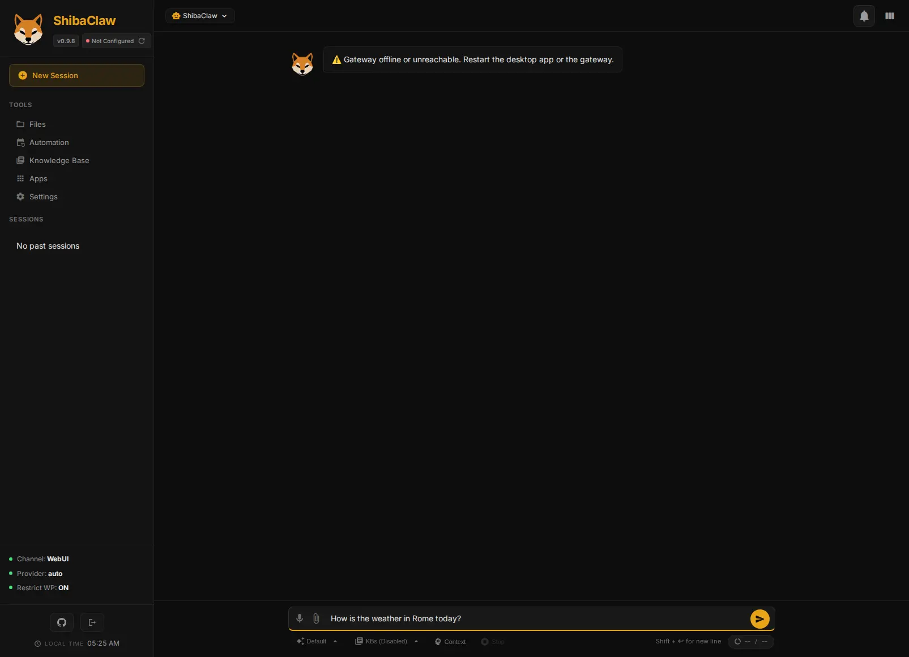

<p align="center">
  
</p>

<h1 align="center">ShibaClaw</h1>

<p align="center"><i>Self-hosted, security-first AI agent with a built-in web UI</i></p>

<p align="center">
  <a href="https://pypi.org/project/shibaclaw/"></a>
  <a href="https://pepy.tech/projects/shibaclaw"></a>
  
  <a href="https://github.com/RikyZ90/ShibaClaw/blob/main/LICENSE"></a>
  <a href="https://deepwiki.com/RikyZ90/ShibaClaw"></a>
</p>

<p align="center">
  <a href="#features">Features</a> ·
  <a href="#quick-start">Quick Start</a> ·
  <a href="#security">Security</a> ·
  <a href="#memory-system">Memory</a> ·
  <a href="#supported-providers">Providers</a> ·
  <a href="#architecture">Architecture</a> ·
  <a href="#channels">Channels</a> ·
  <a href="#troubleshooting">Troubleshooting</a>
</p>

<p align="center">
  🌐 <a href="./README.zh-CN.md">简体中文</a> ·
  <a href="./README.es.md">Español</a> ·
  <a href="./README.pt-BR.md">Português (BR)</a> ·
  <a href="./README.ja.md">日本語</a> ·
  <a href="./README.de.md">Deutsch</a> ·
  <a href="./README.fr.md">Français</a>
</p>

---

ShibaClaw is a self-hosted AI agent you run on your own machine or server: a Python engine with a built-in web UI, native SDK support for 28 model providers, and 11 chat-platform integrations (Discord, Telegram, Slack, WhatsApp, Matrix, and more). It's built around three priorities — simplicity, security, and privacy — with defenses like install-time CVE auditing, prompt-injection wrapping, and SSRF protection shipped in the core engine instead of bolted on as external glue.

<p align="center">
  
</p>

> [!NOTE]
> Release notes live in [CHANGELOG.md](./CHANGELOG.md).

## Features

- **Security-first core** — encrypted credentials vault, install-time CVE audit, prompt-injection wrapping, SSRF/DNS-rebinding guard
- **Three-tier memory** — working, semantic (FAISS), and procedural memory with proactive learning and auto-compaction
- **28 providers, native SDKs** — OpenAI, Anthropic, Gemini, DeepSeek, and more, no LiteLLM proxy layer
- **Web and mobile** — expose the WebUI on your LAN and use the same agent from your phone
- **Windows desktop app** — native launcher with system tray integration
- **MCP-ready** — connect any MCP server, tools are auto-registered

## Quick Start

**Requirements:** Docker, or Python 3.12+ for the pip route. The Windows auto-installer needs neither — it ships a pre-built desktop app.

### Auto-installer (recommended)

One command downloads the latest release, sets up shortcuts, and launches the UI.

> [!TIP]
> Bring your own model: connect to local endpoints (Ollama, LM Studio) or use free API tiers via OpenRouter to start chatting at zero cost.

**Windows (PowerShell):**
```powershell
iwr -useb https://github.com/RikyZ90/ShibaClaw/releases/latest/download/install.ps1 | iex
```

**Linux / macOS:**
```bash
curl -fsSL https://github.com/RikyZ90/ShibaClaw/releases/latest/download/install.sh | bash
```

> [!NOTE]
> On Windows this downloads the pre-built desktop app from the latest GitHub release — no Python required, with Desktop/Start Menu shortcuts and clean uninstall via Apps & Features. On Linux/macOS the script installs via pip in an isolated virtual environment.

### Docker

```bash
curl -fsSL https://raw.githubusercontent.com/RikyZ90/ShibaClaw/main/docker-compose.yml -o docker-compose.yml
docker compose up -d     # pulls from Docker Hub
docker exec -it shibaclaw-gateway shibaclaw print-token
```

Open `http://localhost:3000`, paste the token, and follow the onboarding wizard. Expose `shibaclaw-web` on your LAN (e.g. via reverse proxy) to reach it from your phone.

### pip

```bash
pip install shibaclaw
shibaclaw web --with-gateway   # starts WebUI + agent engine on :3000
```

Open `http://localhost:3000` and follow the onboarding wizard, or run `shibaclaw onboard` for the CLI version of the same setup.

---

## Security

Defenses that are normally scattered across app glue or external proxies ship in the ShibaClaw core, on by default.

| Layer | What it does |
|---|---|
| Install-time audit | Audits `pip` and `npm` before execution — blocks critical/high CVEs |
| Prompt-injection wrap & pre-scan | Wraps every tool result in a randomized `<tool_output_...>` boundary; regex pre-scanning for jailbreaks |
| Shell hardening | 20+ deny patterns, escape normalization, internal URL detection |
| Local-first engine | Native command emulator (`ls`, `cat`) bypasses subprocess overhead; offline `tiktoken` fallback |
| Network guard | SSRF filtering, redirect revalidation, DNS-rebinding-safe resolution |
| Workspace sandbox | File tools and file browser locked to the configured workspace |
| Access control | Bearer token auth, constant-time checks, channel allowlists, optional rate limiting |
| Distributed engine | UI (~128 MB) decoupled from agent brain (~256 MB+) |

Every tool result is wrapped in a dynamically generated boundary with a randomized nonce (e.g. `<tool_output_a1b2c3d4>`), so an attacker can't prematurely close the tag or inject fake system instructions through tool output — the boundary is unpredictable per session.

> [!TIP]
> This wrapping mechanism is also available standalone as [Muzzle](https://github.com/RikyZ90/Muzzle), a zero-dependency Python library you can drop into any agent framework (LangChain, LlamaIndex, CrewAI, AutoGen, or a custom loop).

## Memory System

ShibaClaw uses a three-tier memory architecture:

1. **Working memory** (per session) — rolling context with automatic summarization and token-aware truncation
2. **Semantic memory** (cross-session) — FAISS + sentence-transformers vector store with automatic fact extraction and semantic search
3. **Procedural memory** (skills & automations) — learned workflows saved as reusable skills, plus cron-like schedules

Proactive learning extracts and stores useful facts automatically, auto-compaction keeps context from overflowing, and sessions are stored as append-only JSONL for fast, cache-friendly logging.

## MCP & Integrations

ShibaClaw speaks the Model Context Protocol, so it can connect to any MCP-compliant server — Google Drive, Slack, GitHub, PostgreSQL, and more — without changing core code. Configure servers from the Settings panel.

For popular SaaS tools (Gmail, Google Drive, Slack, GitHub, Outlook...), ShibaClaw integrates with [Klavis](https://klavis.ai): one API key gets you one-click OAuth connections instead of manually registering an OAuth app with each provider. Connected apps are auto-registered as MCP servers in the active session.

## Supported Providers

ShibaClaw uses native SDKs — no LiteLLM proxy — and resolves the provider from the selected model or a provider-prefixed model ID. All configured provider catalogs are merged into one searchable list in the WebUI.

**API key**

| Provider | Env variable |
|---|---|
| OpenAI | `OPENAI_API_KEY` |
| Anthropic | `ANTHROPIC_API_KEY` |
| DeepSeek | `DEEPSEEK_API_KEY` |
| Google Gemini | `GEMINI_API_KEY`¹ |
| Groq | `GROQ_API_KEY` |
| Moonshot | `MOONSHOT_API_KEY` |
| MiniMax | `MINIMAX_API_KEY` |
| Zhipu AI | `ZAI_API_KEY` |
| DashScope | `DASHSCOPE_API_KEY` |

¹ Setting `GEMINI_API_KEY` is sufficient — the OpenAI-compatible endpoint is pre-configured.

**Gateway / proxy** — OpenRouter, AiHubMix, SiliconFlow, VolcEngine, BytePlus, auto-detected by key prefix or `api_base`.

**Local** — Ollama, LM Studio, llama.cpp, vLLM, or any OpenAI-compatible endpoint.

> [!NOTE]
> In Docker, `localhost` points inside the container. To reach a local server on the host (LM Studio, Ollama), use `http://host.docker.internal:PORT` on Windows/macOS or `http://172.17.0.1:PORT` on native Linux.

**OAuth**

| Provider | Flow | Setup |
|---|---|---|
| OpenRouter | PKCE browser flow | WebUI Settings |
| GitHub Copilot | Device flow, auto refresh | `shibaclaw provider login github-copilot` |
| OpenAI Codex | PKCE browser flow | `shibaclaw provider login openai-codex` |

> [!NOTE]
> OpenRouter's OAuth callback reuses the current WebUI URL and port. Behind a reverse proxy, set `SHIBACLAW_OPENROUTER_CALLBACK_BASE_URL` before starting the server.

For zero-cost usage, OpenRouter's free tier (e.g. `nvidia/nemotron-3-super-120b-a12b:free`) and the GitHub Copilot OAuth integration (unlimited access to models like `raptor`) both work well without a paid API key.

## Architecture

<p align="center">
  
</p>

**Docker Compose**

| Service | Role | Default port |
|---|---|---|
| `shibaclaw-gateway` | Core agent loop, message bus, channel integrations | 19999 (HTTP) · 19998 (WS) |
| `shibaclaw-web` | WebUI (Starlette + WebSocket), automations service | 3000 |

Both share the `~/.shibaclaw/` volume (config, workspace, memory, automation jobs, media cache). `shibaclaw web` alone runs agent + WebUI + automations in a single process, no gateway container needed.

**Stack** — Uvicorn/Starlette (ASGI), native WebSocket, vanilla JS + Marked.js + Highlight.js frontend, JSONL append-only sessions.

**Resource usage** — ~120 MB idle / ~350 MB peak per component (gateway, WebUI). Docker Compose caps each container at 512 MB / 256 MB reservation; tool output streams with bounded buffers so long-running commands can't blow up memory.

## CLI Reference

```bash
shibaclaw web               # Start WebUI (agent + automations in-process)
shibaclaw gateway           # Start gateway only (for Docker split)
shibaclaw onboard           # CLI-based first-time setup wizard
shibaclaw agent -m "Hello"  # One-shot message via terminal
shibaclaw agent             # Interactive REPL with history
shibaclaw status            # Provider, workspace, OAuth health check
shibaclaw print-token       # Show WebUI auth token
shibaclaw channels status   # List enabled channels
shibaclaw provider login <p># OAuth login (github-copilot, openai-codex)
shibaclaw desktop           # Launch Windows desktop app
```

## Channels

| Channel | Type | Notes |
|---|---|---|
| WebUI | Built-in | Primary interface, full feature access |
| Discord | Bot | Rich embeds, slash commands, attachments |
| Telegram | Bot | Inline keyboards, media, reply markup |
| WhatsApp | Plugin | Via WhatsApp Web |
| Slack | Bot | Block kit, threads, app mentions |
| DingTalk | Bot | Enterprise messaging |
| Feishu/Lark | Bot | Rich cards, interactive elements |
| QQ | Bot | Group & private messages |
| WeCom | Bot | Workplace communication |
| Matrix | Bot | Decentralized, E2E encryption |
| MoChat | Bot | WeChat ecosystem |

Each channel is configured independently in WebUI Settings and supports hot-reload on config changes.

## Plugin System

ShibaClaw discovers plugins via Python entry points:

- **Channel plugins** — implement `BaseChannel`, discoverable via `shibaclaw.integrations`
- **TTS plugins** — implement `BaseTTS`, discoverable via `shibaclaw.tts`

Built-in: `shibaclaw-channel-whatsapp` (WhatsApp Web) and `shibaclaw-tts-supertonic` (free, offline ONNX speech synthesis, 31 languages). Install or remove plugins from WebUI Settings > Plugins, with hot-reload and version pinning. See [`docs/PLUGINS_DEVELOPMENT_GUIDE.md`](./docs/PLUGINS_DEVELOPMENT_GUIDE.md) to build your own.

## Text-to-Speech

The built-in Supertonic engine runs offline on ONNX (no PyTorch dependency, CPU-only), supports 31 languages with `F1`/`M1` voice profiles and adjustable speed, and plays back through an in-browser widget. Enable it in WebUI Settings > TTS.

## Automation & Scheduling

Background tasks run on cron-like schedules or event triggers (messages, webhooks, system events), in isolated sessions that don't pollute chat history. Manage, monitor, and view logs from the Automations panel; jobs persist across restarts via JSONL storage.

## Knowledge Base (RAG)

Local, privacy-first retrieval-augmented generation: organize documents into named collections (PDF, CSV, HTML, TXT, Markdown), upload via drag-and-drop, and search with a FAISS index over `all-MiniLM-L6-v2` embeddings. The agent can call `knowledge_search` during conversation, or you can target a specific collection with `@kb:name`. It's an optional dependency — install with `pip install shibaclaw[rag]`.

## Troubleshooting

| Problem | Try |
|---|---|
| General status check | `shibaclaw status` |
| Container logs | `docker logs shibaclaw-gateway` / `docker logs shibaclaw-web` |
| WebUI won't connect | Check token with `shibaclaw print-token`, verify port binding |
| Provider errors | `shibaclaw status` shows API key and OAuth state |
| Login fails after upgrading from v0.9.5 | Run `shibaclaw reset-admin` |
| Security policy | [`SECURITY.md`](./SECURITY.md) |

---

<p align="center">
See <a href="./CONTRIBUTING.md">CONTRIBUTING.md</a> to contribute and <a href="./CHANGELOG.md">CHANGELOG.md</a> for release history.
</p>
