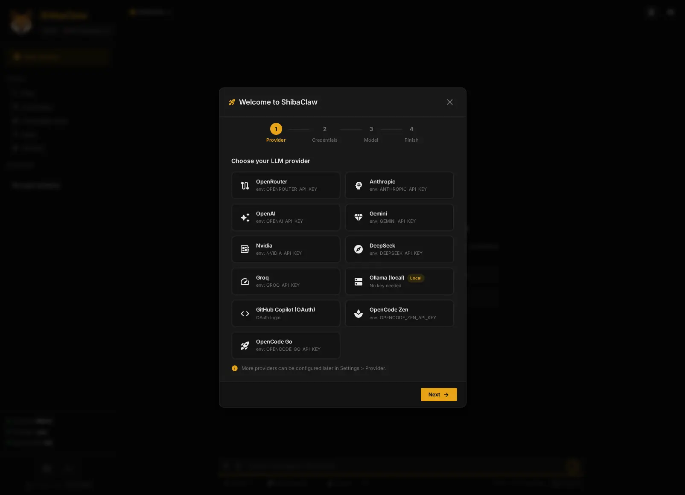
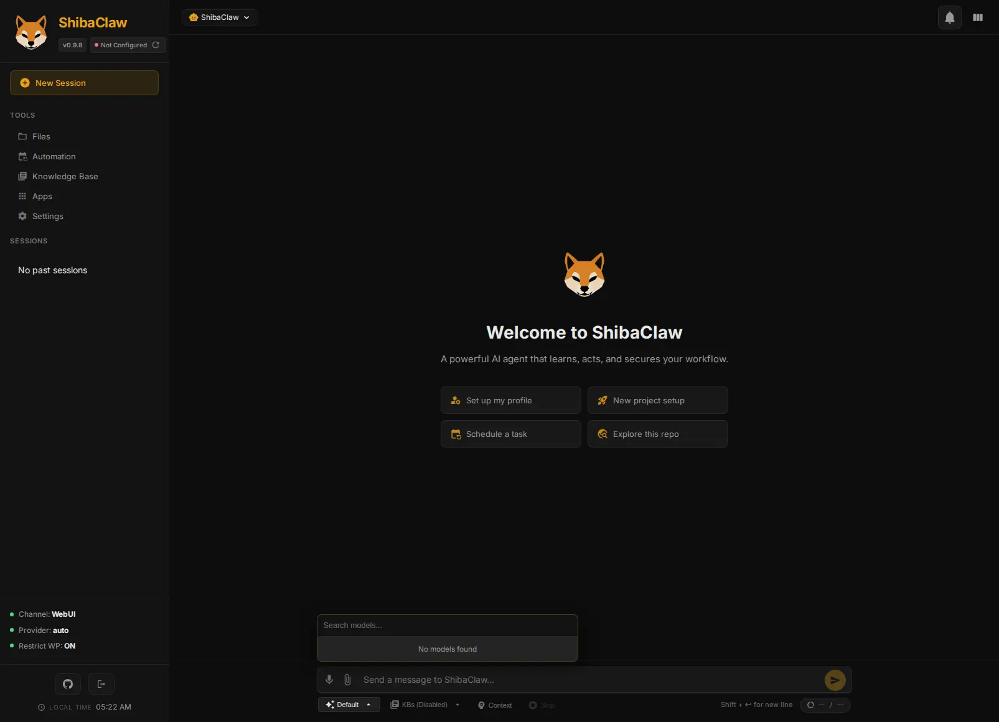

<p align="center">
  
</p>

<h1 align="center">ShibaClaw 🐕</h1>
<h3 align="center">"开箱即用"的 AI 智能体 —— 安全、私密，无需手动照料。</h3>

> 本文档翻译自 [README.md](./README.md)，可能与原文存在偏差（同步至 v0.9.4）。

<p align="center">
  <a href="https://pypi.org/project/shibaclaw/"></a>   
  <a href="https://pepy.tech/projects/shibaclaw"></a>
  
  <a href="https://github.com/RikyZ90/ShibaClaw/blob/main/LICENSE"></a>
  <a href="https://deepwiki.com/RikyZ90/ShibaClaw"></a>
</p>

<p align="center">
  <b>23 家模型提供商 · 11 个聊天渠道 · 内置 WebUI · 安全优先内核 · 兼容 MCP</b>
</p>

<h3 align="center">基于三大支柱：<b>简洁 · 安全 · 隐私</b></h3>

<p align="center">
  🌐 <a href="./README.zh-CN.md">简体中文</a> &nbsp;·&nbsp;
  <a href="./README.es.md">Español</a> &nbsp;·&nbsp;
  <a href="./README.pt-BR.md">Português (BR)</a> &nbsp;·&nbsp;
  <a href="./README.ja.md">日本語</a> &nbsp;·&nbsp;
  <a href="./README.de.md">Deutsch</a> &nbsp;·&nbsp;
  <a href="./README.fr.md">Français</a>
</p>

***

<details open>
<summary>📢 <b>最新版本：v0.9.4</b> —— 点击查看更新内容</summary>

- **Linux 自更新卡在 v0.9.2** —— 修复了 `_get_version()` 即便在成功通过 pip/pipx 升级后仍上报打包清单中陈旧版本的问题。版本解析现在优先使用已安装包的元数据，确保更新器正确收敛。

完整发布历史见 [Changelog](./CHANGELOG.md)。

</details>

***

<p align="center">
  
  
  
</p>

***

## ⚡ 快速开始

### 🚀 自动安装脚本（推荐）

最简单的上手方式。一条命令即可下载最新版本、创建快捷方式并启动界面。

**自带模型**：可无缝接入本地端点（Ollama、LM Studio）或通过 OpenRouter 使用免费 API 额度，零成本开始对话。

**Windows（PowerShell）：**
```powershell
iwr -useb https://github.com/RikyZ90/ShibaClaw/releases/latest/download/install.ps1 | iex
```

**Linux / macOS（终端）：**
```bash
curl -fsSL https://github.com/RikyZ90/ShibaClaw/releases/latest/download/install.sh | bash
```

> **注意**：在 Windows 上，该脚本会从最新 GitHub Release 下载预构建的桌面应用 —— 无需 Python。会自动创建桌面与开始菜单快捷方式，并出现在"应用和功能"中以便干净卸载。在 Linux/macOS 上，脚本会在隔离的虚拟环境中通过 pip 安装。

### Docker

```bash
curl -fsSL https://raw.githubusercontent.com/RikyZ90/ShibaClaw/main/docker-compose.yml -o docker-compose.yml
docker compose up -d     # 从 Docker Hub 拉取
docker exec -it shibaclaw-gateway shibaclaw print-token
```

打开 **http://localhost:3000**，粘贴 token，并按照初始化向导操作。

将 `shibaclaw-web` 暴露到局域网（例如通过反向代理），用手机打开相同 URL 即可在移动端使用智能体。

### pip

```bash
pip install shibaclaw
shibaclaw web --with-gateway   # 在 :3000 启动 WebUI + 智能体引擎
```

打开 **http://localhost:3000** 并按照初始化向导操作。  
偏好 CLI？`shibaclaw onboard` 可在终端运行相同的引导式设置。

***

## ✨ 一个智能体，全部集成

<table>
<tr>
<td align="center" width="33%">

### 🛡️ 安全优先
CVE 审计、提示注入包裹、<br>SSRF 防护 —— <b>默认开启</b>

</td>
<td align="center" width="33%">

### 🧠 智能记忆
三级系统，具备主动学习<br>与自动压缩

</td>
<td align="center" width="33%">

### 🌐 23 家提供商
原生 SDK，无需 LiteLLM 代理<br>OpenAI · Anthropic · Gemini · DeepSeek...

</td>
</tr>
<tr>
<td align="center" width="33%">

### 📱 Web 与移动端
将 WebUI 暴露到局域网，<br>用手机使用同一智能体

</td>
<td align="center" width="33%">

### 🖥️ 桌面应用
原生 Windows 启动器，带托盘，<br>与 WebUI 完美搭配

</td>
<td align="center" width="33%">

### 🔌 兼容 MCP
连接任意 MCP 服务器，<br>工具自动注册

</td>
</tr>
</table>

***

## 为什么选择 ShibaClaw？就是好用。🐕

> **厌倦了比实际工作还需要照看的智能体？**  
> ShibaClaw 围绕一个原则打造：<b>开箱即用</b> —— 安全、可靠，且无需持续维护。

大多数 AI 智能体框架把安全当作事后补丁，让你苦于提供商兼容性，或逼你手动照料配置。ShibaClaw 扭转了局面：安全不是附加件，而是<b>地基</b>。

ShibaClaw 的不同之处：
- **核心内置安全层** —— 安装时 CVE 审计、每个工具结果的提示注入包裹、SSRF/DNS 重绑定防护
- **原生提供商支持** —— 23 家提供商通过其官方 SDK，无需调试代理层
- **一条命令完成设置** —— Docker 或 pip，跟着向导走，约一分钟内即可开始对话
- **随处运行** —— 终端、WebUI、Discord、Telegram、WhatsApp、Windows 桌面应用等

***

## 🛡️ 安全，内置其中

通常分散在应用胶水层或外部代理中的防护 —— 在 ShibaClaw 中它们随核心一同发布，<b>默认开启</b>。

### 核心安全层

| 层级 | 作用 |
|---|---|
| 🔍 安装时审计 | 执行前审计 `pip` 与 `npm` —— 在漏洞落地前拦截严重/高危 CVE |
| 🛡️ 提示注入包裹与预扫描 | 用随机化 `<tool_output_...>` 边界包裹每个工具结果；对越狱尝试进行正则预扫描，并对不可信负载进行 **Base64 编码** |
| 🔒 Shell 加固 | 20+ 拒绝模式、转义规范化（`\x..`、`\u....`）、内部 URL 检测 |
| ⚡ 本地优先引擎 | 原生命令模拟器（`ls`、`cat`）绕过子进程开销；离线优先的 `tiktoken` 回退，支持空气隔离环境执行 |
| 🌐 网络守卫 | SSRF 过滤、重定向重新校验、DNS 重绑定安全解析 |
| 📁 工作区沙箱 | 文件工具与文件浏览器锁定到配置的工作区 |
| 🔑 访问控制 | Bearer token 鉴权、恒定时间校验、渠道白名单、可选速率限制 |
| 🧠 分布式引擎 | UI（≈128 MB）与智能体内核（≈256 MB+）解耦 —— 每进程最小占用 |

### 🛡️ 提示注入包裹（工具沙箱）

ShibaClaw 不会简单地将原始工具输出直接喂回 LLM，而是用动态生成的类 XML 边界与<b>随机 nonce</b>（例如 `<tool_output_a1b2c3d4>`）包裹每个工具结果。

> 💡 <b>独立防御</b>：这一核心安全机制（随机化工具输出包裹）已被解耦并打包为零依赖的 Python 库 [Muzzle](https://github.com/RikyZ90/Muzzle)。你可以用相同的技术保护任何智能体框架（LangChain、LlamaIndex、CrewAI、AutoGen 或自定义 LLM 循环）。

为何重要：攻击者常试图提前闭合标签或在工具输出（如网页内容）中注入伪造的系统指令。通过使用每次迭代生成的随机边界，智能体可可靠区分真实系统指令与注入负载。此外，任何在内容中注入特定闭合标签的尝试都会被自动净化与转义，确保沙箱牢不可破，原始系统提示始终优先。

### 🔍 安装时包自动扫描

在执行任何 `pip`、`npm` 或 `apt` 安装命令前，ShibaClaw 拦截该操作并解析依赖。它运行 `pip-audit` 或 `npm audit --json` 等工具，在应用任何更改前对照 CVE 数据库扫描已知漏洞。

为何重要：它将安全彻底左移。与其盲目阻止包管理器或依赖安装后扫描，它在<i>执行前</i>评估精确的依赖树。若包包含严重/高危 CVE，或检测到可疑标志（如 `apt` 的 `--allow-unauthenticated`），安装将被阻止。这让 AI 能自主构建软件，而不把主机变成隐患。

完整披露政策与支持版本见 [SECURITY.md](./SECURITY.md)。

***

## 🖥️ 原生桌面应用（Windows）

ShibaClaw 提供完全集成的 **Windows 桌面启动器**，基于 `pywebview` 构建。  
它提供无缝的本地体验，无需管理后台终端窗口。

- **系统托盘集成**：关闭窗口时静默最小化到系统托盘。右键 Shiba 图标可重新打开 UI、查看工作区日志、访问网站或优雅退出引擎。
- **自动登录**：本地使用桌面启动器时，默认绕过 WebUI 鉴权，提供更顺畅的本地优先体验。
- **嵌入式 WebUI**：无需打开浏览器；WebUI 运行在专用原生窗口框架内。
- **便携轻量**：使用 PyInstaller 打包为单一独立文件夹，无需主机安装 Python 即可即时运行。

若通过 `pip` 安装：
```bash
shibaclaw desktop
```

或直接下载预构建的 Windows 可执行文件：

> **[⬇ 下载 ShibaClaw.exe（最新）](https://github.com/RikyZ90/ShibaClaw/releases/latest/download/ShibaClaw-windows.zip)**  
> 完整发布说明 → [github.com/RikyZ90/ShibaClaw/releases/latest](https://github.com/RikyZ90/ShibaClaw/releases/latest)

***

## 🌐 WebUI

<p align="center">
  
  
  
</p>

WebUI 是内置的 —— 无需独立前端或 Node.js。

将其暴露到本地网络，用手机或平板打开相同 URL —— 无需额外应用，只需浏览器。

- **聊天** —— 多会话对话，实时流式显示工具调用、思考块、耗时，以及通过聊天页脚进行的每会话模型切换
- **本地 RAG 与知识库** —— 拖放或上传文档（PDF、CSV、HTML、TXT）创建本地集合，通过语义搜索查询，并将活动集合固定到会话
- **上下文提及（@）** —— 使用 `@` 在消息中自动补全并绑定知识库、MCP 服务器和已连接应用，以引导智能体焦点
- **跨提供商模型搜索** —— 统一可搜索选择器合并所有已配置提供商的模型，显示提供商标签，并在更改会话模型时切换实时运行时提供商
- **智能体档案** —— 每会话切换人格（Hacker、Builder、Planner、Reviewer），带有动态头像
- **文件浏览器** —— 在浏览器中浏览、查看和编辑工作区文件（沙箱限制在工作区内）
- **语音** —— 通过 OpenAI 兼容音频 API 的语音转文本，以及浏览器原生 TTS
- **设置** —— 从单一面板配置默认会话模型、记忆/压缩模型、提供商、工具、MCP 服务器、渠道、技能与 OAuth
- **初始化向导** —— 引导式首次设置：选择提供商、输入 API key 或开始 OAuth、选择模型
- **上下文查看器** —— 检查完整系统提示与 token 用量明细
- **网关监视器** —— 健康检查与一键重启
- **OAuth 流程** —— GitHub Copilot、OpenAI Codex 与 OpenRouter 均可在设置弹窗中配置；OpenRouter 将返回的 API key 直接存入提供商设置
- **加固渲染** —— 聊天 Markdown 转义原始 HTML，文件名通过安全 DOM 节点渲染，过期鉴权干净返回登录而不会出现重连循环
- **自动更新** —— 每 12 小时检查 GitHub 发布，在 UI 与所有活动渠道通知
- **通知中心（WIP）** —— 带未读标记的铃铛图标、实时 WebSocket 推送、每条通知深度链接到相关会话；覆盖后台自动化、智能体响应与更新提醒
- **响应式** —— 在桌面与移动端都表现良好；在沙发上而非只在书桌前打开同一智能体 UI

### ⚡ 动态模型选择

<p align="center">
  
</p>

每会话更换模型 —— 不再是单一全局模型，而是每次对话的灵活选择。

- **多提供商搜索**：在单一下拉中搜索所有已配置提供商（OpenRouter、GitHub Copilot、Anthropic 等）的全部模型。
- **会话感知路由**：每个会话记住其选定模型。你可以同时拥有一个使用 `Claude 3.5 Sonnet` 的编码会话和一个使用 `Gemma 4` 的研究会话。
- **运行时切换**：无需重启智能体即可即时切换模型；网关根据所选模型自动解析正确端点。
- **专用记忆模型**：为记忆压缩与主动学习配置单独的模型与提供商，确保高质量状态提取而不影响聊天预算。
- **默认优先**：新会话自动以设置中的默认模型启动，确保即时一致性。

### 🤖 智能体档案

在不丢失上下文的情况下即时切换智能体人格。每个档案覆盖系统提示（SOUL.md），同时共享模型、记忆与工具。档案按会话划分 —— 在一个标签页做安全审计，在另一个标签页规划架构。

内置档案：Default · Builder · Planner · Reviewer · <b>Hacker</b>（精英安全专家，含 50+ 工具建议、OWASP/MITRE/NIST 方法论、CVSS 评分，以及自定义赛博柴犬头像）。

交互式创建你自己的档案 —— 智能体会引导你定义人格并自动保存一切。

***

## 🧠 高级三级记忆系统

ShibaClaw 的记忆不只是滚动聊天缓冲；它是一个结构化的主动系统，为长期运行连续性而设计。

- **`USER.md`（身份与偏好）：** 存储持久的个人事实、沟通风格与语言偏好。智能体读取它以了解<i>你是谁</i>。
- **`MEMORY.md`（运行状态）：** 智能体的工作知识。它跟踪环境细节、重复出现的实体与项目状态。
- **`HISTORY.md`（会话存档）：** 仅追加、可搜索的过往会话账本，带时间戳与标签摘要。

ShibaClaw 不是用数千条消息撑大系统提示，而是具备**主动学习循环**。每 N 条消息，后台 LLM 进程静默提取新的持久事实并更新 `USER.md` 与 `MEMORY.md`，不打断对话。当 `MEMORY.md` 过大时，自动压缩例程会总结并去重上下文，优先近期状态同时将 token 用量控制在严格预算内。当智能体需要更旧上下文时，可通过 TF-IDF 与近期性评分自主搜索 `HISTORY.md`。这种关注点分离确保智能体对当前项目保持高度感知，而永远不会触及 token 上限或丢失焦点。

***

## 🛠️ 功能

### 工作流与推理

- **模型优先会话路由** —— 每个会话存储自身选定模型，ShibaClaw 在运行时从该模型解析正确的提供商后端
- **专注后台委派** —— `spawn` 工具可卸载特定任务，并在完成时回报主会话
- **高级推理** —— 支持扩展思考（Anthropic）、推理力度（OpenAI o-series）与 DeepSeek-R1 链

### 工具

| 工具 | 作用 |
|------|-------------|
| `exec` | 带 20+ 拒绝模式守卫、编码规范化与 CVE 扫描的 Shell 命令 |
| `read_file` / `write_file` / `edit_file` | 分页读取、模糊查找替换、自动创建父目录 |
| `web_search` | Brave、Tavily、SearXNG、Jina 或 DuckDuckGo（无 key 回退） |
| `web_fetch` | 带 SSRF 防护、DNS 重绑定防御与重定向校验的 HTTP 获取 |
| `memory_search` | 对会话历史的排名搜索（TF-IDF + 近期性 + 重要性评分） |
| `knowledge_search` | 对活动/被提及的本地知识库集合的语义搜索（FAISS 向量存储） |
| `message` | 跨渠道消息与媒体附件 |
| `automation` | 管理或调度后台任务（cron 表达式、间隔、ISO 日期、时区感知） |
| `spawn` | 可选后台 worker 处理专注任务；完成时回报主会话 |
| MCP | 连接任意 MCP 服务器（stdio、SSE 或 streamable HTTP）—— 工具自动注册为 `mcp_<server>_<tool>` |

### 渠道

Telegram · Discord · Slack · WhatsApp · Matrix · Email · DingTalk · Feishu · QQ · WeCom · MoChat

所有渠道通过同一消息总线路由。WhatsApp 使用 Node.js 桥接（Baileys）进行二维码绑定。

### 技能

8 个内置技能（GitHub、weather、summarize、tmux、automation、memory guide、skill-creator、ClawHub browser）。技能是带 YAML frontmatter 与可选脚本的 Markdown 文件 —— 可自建或从 [ClawHub](https://clawhub.ai/) 安装。将常用技能固定以在每次对话中加载。

### 自动化

- **自动化引擎** —— 持久、时区感知的定时任务与后台间隔例程，通过统一 UI 弹窗管理并存储于 `automation.json`。支持 `every`、`cron` 与 `at` 调度。错过的任务在启动时自动快进，防止执行风暴。
- **TASK.md 集成** —— 引擎使用 `TASK.md` 作为后台例程的统一事实来源，当任务为空时完全跳过 LLM 以节省 token，仅处理活动指令。

若从旧版本升级，`HEARTBEAT.md` 已弃用并移除。你的任务与调度应迁移到 `TASK.md` 与新的自动化 UI。

### 🔌 插件与 TTS（文本转语音）

- **可安装插件系统** —— 通过动态的、可安装的 Python 插件（如语音合成、自定义集成）扩展智能体能力，可直接从 WebUI 设置管理。构建方法见 [`docs/PLUGINS_DEVELOPMENT_GUIDE.md`](./docs/PLUGINS_DEVELOPMENT_GUIDE.md)。
- **免费离线本地 TTS（Supertonic）** —— 通过 **Supertonic TTS** 插件（基于 ONNX 的语音合成）开箱即用地获得高质量、零成本、完全离线的文本转语音。支持 31 种语言、自定义声音（`F1` / `M1`）与可调语速，自动合成语音响应。
- **浏览器内音频播放器** —— 通过自定义玻璃拟态音频组件（带可拖动时间线与时长控制）在聊天 UI 中直接播放智能体的语音消息。

***

## 🔌 MCP 生态

ShibaClaw 完全兼容 **Model Context Protocol (MCP)**，将智能体从独立工具转变为即插即用的 AI 中枢。

ShibaClaw 不只依赖内置技能，还可连接任意兼容 MCP 的服务器，无需修改核心代码一行即可立即赋予智能体海量外部数据源与专业工具。

为何重要：
- **即时可扩展**：接入社区制作的 MCP 服务器，用于 Google Drive、Slack、GitHub、PostgreSQL 等。
- **标准化工具**：利用 AI 到工具的通用协议，确保稳定性与互操作性。
- **解耦架构**：在通过分布式 MCP 服务器网络扩展能力的同时保持智能体精简。

直接在**设置**面板中配置你的 MCP 服务器，开始拓展 ShibaClaw 的边界。

### 🌐 应用（Klavis 集成）

为使设置热门 SaaS 工具（如 Gmail、Google Drive、Google Docs、Slack、GitHub、Outlook 等）尽可能无缝，ShibaClaw 集成了 **Klavis**（`klavis.ai`）。

ShibaClaw 无需用户在 Google Cloud 或 Microsoft Azure 控制台为每个服务手动创建开发者凭据、配置 OAuth 同意屏幕与设置重定向 URL，而是通过统一的 **Connected Apps** 界面管理所有这些集成：

- **单一 API Key**：从 [klavis.ai](https://klavis.ai) 获取一个 API key 并保存到 ShibaClaw 后端设置。
- **一键连接**：使用由 Klavis 网关直接管理的安全 OAuth 登录，一键连接或断开 Gmail、Slack 等服务。
- **自动生成的 MCP 服务器**：应用连接后，ShibaClaw 自动配置合适的 MCP 服务器与标准工具，并无缝注册到活动智能体会话。

***

## 🌐 支持的提供商

ShibaClaw 使用原生 SDK（无 LiteLLM 代理），并从所选模型或规范化的提供商前缀模型 ID 解析活动提供商。在 WebUI 中，所有已配置提供商目录合并为单一可搜索列表，而每个会话保留自身选定模型。

### API Key

| 提供商 | 环境变量 |
|----------|-------------|
| OpenAI | `OPENAI_API_KEY` |
| Anthropic | `ANTHROPIC_API_KEY` |
| DeepSeek | `DEEPSEEK_API_KEY` |
| Google Gemini | `GEMINI_API_KEY` ¹ |
| Groq | `GROQ_API_KEY` |
| Moonshot | `MOONSHOT_API_KEY` |
| MiniMax | `MINIMAX_API_KEY` |
| Zhipu AI | `ZAI_API_KEY` |
| DashScope | `DASHSCOPE_API_KEY` |

¹ 在环境中设置 `GEMINI_API_KEY` 即足够 —— 无需存储 key。Google OpenAI 兼容端点已预配置。

### 网关 / 代理

OpenRouter · AiHubMix · SiliconFlow · VolcEngine · BytePlus —— 通过 key 前缀或 `api_base` 自动检测。

### 本地

Ollama (`http://localhost:11434`) · LM Studio · llama.cpp · vLLM · 任意 OpenAI 兼容端点（`http://localhost:1234/v1`）

> **Docker 用户注意：** 若通过 Docker Compose 运行 ShibaClaw，`localhost` 指向容器内部。要连接主机上运行的本地服务器（如 Windows/Mac 上的 LM Studio 或 Ollama），请使用：
> `http://host.docker.internal:1234/v1`（Ollama 用 `11434`）。原生 Linux 上使用 `http://172.17.0.1:port`。

### OAuth

| 提供商 | 流程 | 设置 |
|----------|------|-------|
| OpenRouter | PKCE 浏览器流程，将返回的 API key 存入提供商配置 | WebUI 设置 |
| GitHub Copilot | 设备流程，自动刷新 token | `shibaclaw provider login github-copilot` 或 WebUI 设置 |
| OpenAI Codex | PKCE 浏览器流程 | `shibaclaw provider login openai-codex` 或 WebUI 设置 |

对于 OpenRouter，回调默认复用当前 WebUI URL 与端口，因此 `http://localhost:3000` 并非专用的仅 OAuth 端口。若你将 WebUI 暴露在反向代理后或需要不同的公共回调来源，请在启动服务器前设置 `SHIBACLAW_OPENROUTER_CALLBACK_BASE_URL=https://your-public-webui-host`。

### 💡 专业提示：高性价比与 premium 模型

ShibaClaw 即使在没有昂贵 API 用量的情况下也表现出色：
- **免费/开源模型：** 强烈推荐使用 **OpenRouter** 访问强大的免费模型，如 `nvidia/nemotron-3-super-120b-a12b:free` 或 `gemma-4-31b-it:free`。
- **无限 premium：** 若使用 **GitHub Copilot** OAuth 集成，你可零额外成本访问 premium 模型，如 `raptor`（`oswe-vscode-prime`），实际上获得无限请求。

***

## 📊 ShibaClaw 对比（安全优先）

> 此表为**粗略的、以安全为重点的快照**，仅基于截至 2026 年 5 月公开仓库/文档中明确记录的内容。  
> `❓` 表示"未清晰记录 / 未检查"，<b>而非</b>"不存在"。

| 安全特性 | ShibaClaw | OpenClaw | Hermes Agent | Nanobot | ZeroClaw |
|---|:---:|:---:|:---:|:---:|:---:|
| 安装时 CVE 审计（pip、npm、apt） | ✅ | ❌ | ❌ | ❌ | ❌ |
| 每个工具结果的提示注入包裹 | ✅ | ❌ | ❌ | ❌ | ❌ |
| 内置 SSRF + DNS 重绑定防护 | ✅ | ❌ | ❌ | ❌ | ❌ |

ShibaClaw 专注于将这些防御发布在核心引擎中、默认开启，因此你无需为安全运行智能体而拼凑外部扫描器与代理。

***

## 🏗️ 架构

<p align="center">
  
</p>

### Docker Compose

| 服务 | 角色 | 默认端口 |
|---------|------|--------------|
| `shibaclaw-gateway` | 核心智能体循环、消息总线、渠道集成 | 19999 (HTTP) · 19998 (WS) |
| `shibaclaw-web` | WebUI（Starlette + 原生 WebSocket）、自动化服务 | 3000 |

两者共享 `~/.shibaclaw/` 卷（配置、工作区、记忆、自动化任务、媒体缓存）。

### 单进程模式

`shibaclaw web` 在单一进程中运行智能体 + WebUI + 自动化 —— 无需网关容器。

### 技术栈

| 层 | 技术 |
|-------|-----------|
| 服务器 | Uvicorn → Starlette (ASGI) |
| 实时 | 原生 WebSocket（WebUI 上的 `/ws`，网关端口 `19998`） |
| 前端 | Vanilla JS · Marked.js · Highlight.js |
| 会话 | 每会话 JSONL 仅追加（对 LLM 提示前缀缓存友好） |

### 资源占用

| 组件 | 空闲 | 峰值（安装/编译） |
|-----------|------|------------------------|
| 网关 | ~120 MB | ~350 MB |
| WebUI | ~120 MB | ~350 MB |

Docker Compose 设置每容器 512 MB 上限 / 256 MB 预留。工具输出以有界缓冲流式传输，因此长时间运行的命令（`apt`、`npm install`）不会撑爆内存。

***

## 🔧 CLI 参考

```bash
shibaclaw web               # 启动 WebUI（智能体 + 自动化进程内）
shibaclaw gateway           # 仅启动网关（用于 Docker 拆分）
shibaclaw onboard           # 基于 CLI 的首次设置向导
shibaclaw agent -m "Hello"  # 通过终端的一次性消息
shibaclaw agent             # 带历史的交互式 REPL
shibaclaw status            # 提供商、工作区、OAuth 健康检查
shibaclaw print-token       # 显示 WebUI 鉴权 token
shibaclaw channels status   # 列出已启用渠道
shibaclaw provider login <p># OAuth 登录（github-copilot、openai-codex）
shibaclaw desktop           # 启动 Windows 桌面应用
```

***

## 🐛 故障排查

| 问题 | 尝试 |
|---------|-----|
| 一般状态检查 | `shibaclaw status` |
| 容器日志 | `docker logs shibaclaw-gateway` / `docker logs shibaclaw-web` |
| WebUI 无法连接 | 用 `shibaclaw print-token` 检查 token，验证端口绑定 |
| 提供商错误 | `shibaclaw status` 显示 API key 与 OAuth 状态 |
| 安全策略 | [`SECURITY.md`](./SECURITY.md) |

***

## 🤝 贡献

见 [`CONTRIBUTING.md`](./CONTRIBUTING.md) —— 欢迎 PR。

插件（渠道与 TTS 引擎）可通过 Python entry points 扩展。构建自定义插件的完整指南见 [`docs/PLUGINS_DEVELOPMENT_GUIDE.md`](./docs/PLUGINS_DEVELOPMENT_GUIDE.md)。技能创建见 [`docs/CHANNEL_PLUGIN_GUIDE.md`](./docs/CHANNEL_PLUGIN_GUIDE.md) 与内置的 `skill-creator` 技能。

网关集成者：端口 `19998` 的 WebSocket 契约见 [`docs/GATEWAY_PROTOCOL.md`](./docs/GATEWAY_PROTOCOL.md)。

***

## 🌟 加入 ShibaClaw 大家庭

ShibaClaw 由一位开发者构建，由社区维护，并快速增长。  
如果它为你节省了时间、保护了你的工作流，或只是让你会心一笑 —— <b>请留下一颗星</b> ⭐

> "开箱即用的 AI 智能体。无需照料。" 🐕

<p align="center">
  ⭐ <a href="https://github.com/RikyZ90/ShibaClaw">给仓库加星</a> &nbsp;·&nbsp;
  ☕ <a href="https://buymeacoffee.com/rikyz90f">请我喝杯咖啡</a> &nbsp;·&nbsp;
  🐛 <a href="https://github.com/RikyZ90/ShibaClaw/issues">提交 issue</a> &nbsp;·&nbsp;
  🔧 <a href="https://github.com/RikyZ90/ShibaClaw/pulls">发送 PR</a>
</p>